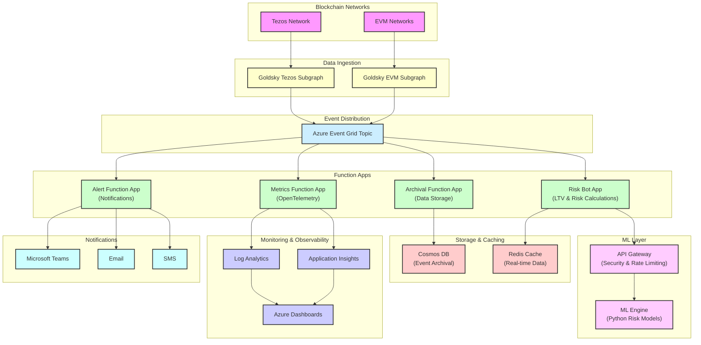

# vv-chain-services
Blockchain integration and event processing services

This repository contains the event-driven microservices responsible for ingesting, processing, analyzing, and archiving blockchain event data from Tezos and EVM networks. It is part of the VeritasVault.ai platform and is tightly integrated with Goldsky, Azure Event Grid, and a distributed risk intelligence engine powered by Python-based ML.

The solution is designed with resilience, observability, and modularity in mind — allowing independent teams to scale risk models, extend observability, or hook in new event sources with minimal friction.

## 📚 Table of Contents
- [🔧 Chain and Services Architecture](#-chain-and-services-architecture)
- [🔧 Repository Structure](#-repository-structure)
- [📀 Data Flow Overview](#-data-flow-overview)
- [⚖️ Azure Components](#-azure-components)
- [🎓 Use Case Handlers](#-use-case-handlers)
- [🔨 Goldsky Setup Notes](#-goldsky-setup-notes)
- [🌐 Security & Observability](#-security--observability)
- [♻️ Benefits](#-benefits)

```text

```

## Chain and Services Architecture



## 🔧 Repository Structure

```
vv-iac/                                # Separate repo - Infrastructure as Code
├── .github/
│   └── workflows/                     # CI/CD pipelines for Azure Functions and ML Engine
│       ├── risk-function-ci.yml       # Separate CI/CD for Risk Function App
│       ├── alert-function-ci.yml      # Separate CI/CD for Alert Function App
│       ├── metrics-function-ci.yml    # Separate CI/CD for Metrics Function App
│       ├── archival-function-ci.yml   # Separate CI/CD for Archival Function App
│       └── ml-engine-ci.yml           # CI/CD for Python ML Engine
├── infra/                      
│   ├── bicep/
│   │   ├── main.bicep                # Main deployment template
│   │   ├── eventgrid.bicep           # Event Grid resources
│   │   ├── functions.bicep           # Function Apps
│   │   ├── storage.bicep             # Storage resources
│   │   ├── monitoring.bicep          # Monitoring resources
│   │   ├── api-gateway.bicep         # New: API Gateway for ML Engine isolation
│   │   └── ml-engine.bicep           # New: Separate ML Engine infrastructure
│   └── scripts/
│       ├── deploy.ps1                # Deployment scripts
│       └── setup-goldsky.sh          # Goldsky setup script
├── tests/                            # New: Infrastructure tests
├── bicep-linter.yml                  # Bicep linting configuration
      └── whatif-tests.ps1            # WhatIf tests for infrastructure changes


vv-chain-services/
|__ .github/                          # NOTE: Created througgh IAC repo and scripted here -  consolidates our piepelines 
├── .gitignore                        # Ensure local.settings.json is excluded
├── package.json                      # Root package.json for workspace management
├── docs                              # NOTE: Created through our docs repo, duplicated here for ease of reference
├── src/
│   ├── function-apps/                # Separated Function Apps for independent scaling/SLAs
│   │   ├── RiskBotApp/               # Renamed from RiskFunctionApp to align with internal naming
│   │   │   ├── RiskBotFunction.cs    # Main Azure Function
│   │   │   ├── RiskApiClient.cs      # Calls Python ML engine
│   │   │   ├── Models.cs             # Data contracts
│   │   │   ├── Helpers.cs
│   │   │   ├── host.json             # Function App host configuration
│   │   │   └── local.settings.json   # Will be excluded via .gitignore
│   │   ├── MetricsFunctionApp/       # OpenTelemetry metrics publishing
│   │   │   ├── MetricsBotFunction.cs
│   │   │   ├── TelemetryService.cs
│   │   │   ├── host.json
│   │   │   └── local.settings.json   # Will be excluded via .gitignore
│   │   ├── AlertFunctionApp/         # Notification triggers
│   │   │   ├── AlertFunction.cs
│   │   │   ├── NotificationService.cs
│   │   │   ├── host.json
│   │   │   └── local.settings.json  # Will be excluded via .gitignore
│   │   └── ArchivalFunctionApp/     # Data storage operations
│   │       ├── ArchivalFunction.cs
│   │       ├── StorageService.cs
│   │       ├── host.json
│   │       └── local.settings.json  # Will be excluded via .gitignore
│   ├── shared/                      # Shared code and utilities
│   │   ├── models/                  # Data models
│   │   │   ├── EventModels.cs
│   │   │   └── DomainModels.cs
│   │   ├── services/                # Service integrations
│   │   │   ├── CosmosDbService.cs
│   │   │   ├── RedisService.cs
│   │   │   └── KeyVaultService.cs
│   │   └── utils/                   # Helper functions
│   │       ├── EventGridHelpers.cs
│   │       └── TelemetryHelpers.cs
│   ├── goldsky/                    # Goldsky subgraph definitions
│   │   ├── .goldsky-version        # Track Goldsky CLI version used
│   │   ├── subgraph.config.yml     # Configuration for multiple GraphQL schemas
│   │   ├── tezos/                  # Tezos-specific subgraphs
│   │   │   └── schema.graphql
│   │   └── evm/                    # EVM-specific subgraphs
│   │       └── schema.graphql
│   └── ml-engine/                  # Python ML Engine (separate deployable unit)
│       ├── app/
│       │   ├── main.py             # FastAPI app
│       │   ├── models/             # ML models (pickle / joblib / ONNX)
│       │   ├── services/           # Risk calculations
│       │   ├── schemas/            # Input/output Pydantic schemas
│       │   └── utils/              # Normalizers, scorers, etc.
│       ├── tests/                  # Python-specific tests
│       │   ├── test_risk_calculations.py
│       │   └── test_api.py
│       ├── requirements.txt        # Python dependencies
│       ├── Dockerfile              # ML Engine container definition
│       └── package.json            # Node.js dependencies for ML Engine
├── tests/                          # C# tests for Azure Functions
│   ├── RiskBotTests/
│   │   ├── RiskBotFunctionTests.cs
│   │   └── RiskApiClientTests.cs
│   ├── MetricsFunctionTests/
│   ├── AlertFunctionTests/
│   └── ArchivalFunctionTests/
└── README.md                       # Repository documentation

```

## 📀 Data Flow Overview

```
Blockchain (Tezos / EVM)
        ⬇️
    Goldsky Subgraph
        ⬇️
     [Webhook Output]
        ⬇️
Azure Event Grid Topic
        ⬇️
 +--------------------+----------------------+------------------+
 |                    |                      |                  |
 V                    V                      V                  V
Risk Bot         Metrics Bot         Alert Function      Archival Function
(Estimates, LTV) (OpenTelemetry)     (Notify, Email)     (Store to Cosmos DB)
```

## ⚖️ Azure Components

| Component              | Purpose                                                      |
|------------------------|--------------------------------------------------------------|
| Event Grid Topic       | Central hub for blockchain event publications                |
| Event Subscriptions    | Routes Goldsky event data to various handlers                |
| Azure Function Apps    | Stateless logic (risk calculations, alert triggers)          |
| Azure Queue (optional) | Buffer layer if retries/delays are needed                    |
| Cosmos DB              | Long-term archival of structured indexed events              |
| Redis                  | Shared memory cache for downstream services                  |
| OpenTelemetry          | Unified observability for metrics, traces, and logs          |
| Azure Monitor / Log Analytics | Logs and telemetry aggregation for debugging and insight |

## 🎓 Use Case Handlers

**Risk Function App:**
- Triggers on new asset price updates
- Recalculates portfolio LTV and TVL
- Publishes to Redis for dashboard
- Communicates with ML Engine for risk analysis

**Metrics Function App:**
- Extracts event type and timing
- Publishes metrics via OpenTelemetry
- Monitors system health and performance

**Alert Function App:**
- If LTV > threshold or abnormal TXs
- Sends to Teams / Email / SMS (via Logic App)
- Handles notification throttling and aggregation

**Archival Function App:**
- Batches and stores full JSON payloads
- Writes to Cosmos DB with TTL
- Manages data partitioning and indexing

## 🔨 Goldsky Setup Notes

- Use `webhook` target type (POST)
- Payload format: JSON
- Use filtering logic in subgraph to minimize spam
- Include retry logic on failed webhook delivery (Goldsky handles retries)
- Include event signatures and timestamps for deduplication

## 🌐 Security & Observability

- All endpoints authenticated with Managed Identity
- Each Function App has its own Managed Identity with specific RBAC permissions
- OpenTelemetry integration for unified observability
- Event Grid Dead Letter Queue for failed delivery tracking
- Alerts routed to Security Center if abnormal spike in payloads
- Key Vault integration for secure secret management

## ♻️ Benefits of This Architecture

#### **Decoupled Processing:**
Each Function App operates independently, allowing for flexible scaling and deployment

#### **High Resilience:**
Event Grid provides reliable delivery with retries and dead letter queues

#### **Scalable:**
Can handle increasing volumes of blockchain events as the platform grows

#### **Observable:**
Comprehensive logging and monitoring throughout the pipeline

#### **Secure:**
Managed Identities and Key Vault integration for secure secret management

#### **DevOps-Friendly:**
Infrastructure as Code (Bicep) for repeatable deployments

#### **Independent Scaling:**
Each Function App can scale based on its specific workload and requirements
