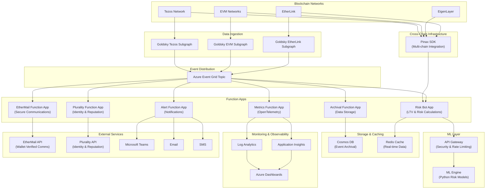

# vv-chain-services

Blockchain integration and event processing services for the VeritasVault.ai platform.

## 🔍 Overview

This repository contains the event-driven microservices responsible for ingesting, processing, analyzing, and archiving blockchain event data from Tezos and EVM networks. It is part of the VeritasVault.ai platform and is tightly integrated with Pinax, Plurality, Goldsky, EtherMail, EigenLayer, and EtherLink, with a distributed risk intelligence engine powered by Python-based ML.

The solution is designed with resilience, observability, and modularity in mind — allowing independent teams to scale risk models, extend observability, or hook in new event sources with minimal friction.

## 📚 Table of Contents

- [🔧 Chain and Services Architecture](#-chain-and-services-architecture)
- [🏗️ Development Environment](#-development-environment)
- [📂 Repository Structure](#-repository-structure)
- [📀 Data Flow Overview](#-data-flow-overview)
- [⚙️ Running the Project Locally](#-running-the-project-locally)
- [⚖️ Azure Components](#-azure-components)
- [🎓 Use Case Handlers](#-use-case-handlers)
- [🔗 Platform Integrations](#-platform-integrations)
- [🚀 Deployment](#-deployment)
- [🧪 Testing](#-testing)
- [🔨 Goldsky Setup Notes](#-goldsky-setup-notes)
- [🌐 Security & Observability](#-security--observability)
- [♻️ Benefits](#-benefits-of-this-architecture)
- [📝 Documentation](#-documentation)
- [👥 Contributing](#-contributing)

## 🔧 Chain and Services Architecture



## 🏗️ Development Environment

This project uses Visual Studio Code Dev Containers for a consistent development experience.

### Prerequisites

- [Docker Desktop](https://www.docker.com/products/docker-desktop)
- [Visual Studio Code](https://code.visualstudio.com/)
- [Remote - Containers extension](https://marketplace.visualstudio.com/items?itemName=ms-vscode-remote.remote-containers)

### Getting Started

1. Clone the repository
2. Open the project in VS Code
3. When prompted, click "Reopen in Container" or run the "Remote-Containers: Reopen in Container" command
4. The container will build and set up the development environment

For more detailed information about the workspace configuration, see [WORKSPACE.md](WORKSPACE.md).

## 📂 Repository Structure

This repository follows a modular structure to support independent development and deployment of components:

```
vv-chain-services/
├── src/
│   ├── function-apps/           # Separated Function Apps for independent scaling/SLAs
│   │   ├── RiskBotApp/          # Risk calculation and ML integration
│   │   ├── MetricsFunctionApp/  # OpenTelemetry metrics publishing
│   │   ├── AlertFunctionApp/    # Notification triggers
│   │   ├── EtherMailApp/        # Wallet-verified secure communications
│   │   ├── PluralityApp/        # Identity and reputation management
│   │   └── ArchivalFunctionApp/ # Data storage operations
│   ├── shared/                  # Shared code and utilities
│   │   ├── PinaxSDK/            # Pinax multi-chain integration SDK
│   │   ├── EtherMailClient/     # EtherMail API client
│   │   ├── PluralityClient/     # Plurality API client
│   │   ├── EigenLayerSDK/       # EigenLayer integration SDK
│   │   ├── EtherLinkSDK/        # EtherLink compatibility layer SDK
│   │   └── GoldskyModels/       # Goldsky event models and parsers
│   ├── goldsky/                 # Goldsky subgraph definitions
│   │   ├── tezos/               # Tezos-specific subgraphs
│   │   ├── evm/                 # EVM-specific subgraphs
│   │   └── etherlink/           # EtherLink-specific subgraphs
│   └── ml-engine/               # Python ML Engine (separate deployable unit)
└── tests/                       # C# tests for Azure Functions
```

For a complete folder structure with detailed explanations, see [FOLDER-STRUCTURE.md](FOLDER-STRUCTURE.md).

## 📀 Data Flow Overview

```
Blockchain (Tezos / EVM / EigenLayer / EtherLink)
        ⬇️
    Goldsky Subgraph       Pinax SDK
        ⬇️                    ⬇️
     [Webhook Output]    [Cross-Chain Data]
        ⬇️                    ⬇️
Azure Event Grid Topic
        ⬇️
 +--------------------+----------------------+------------------+------------------+------------------+
 |                    |                      |                  |                  |                  |
 V                    V                      V                  V                  V                  V
Risk Bot         Metrics Bot         Alert Function      Archival Function   EtherMail Function  Plurality Function
(Estimates, LTV) (OpenTelemetry)     (Notify, Email)     (Store to Cosmos)   (Secure Comms)      (Identity & Rep)
```

## ⚙️ Running the Project Locally

### Start the ML Engine

```bash
cd src/ml-engine
uvicorn app.main:app --reload --port 8000
```

### Start the Azure Functions

```bash
# Start Risk Bot App
cd src/function-apps/RiskBotApp
func start

# Start EtherMail Function App
cd src/function-apps/EtherMailApp
func start

# Start Plurality Function App
cd src/function-apps/PluralityApp
func start

# Start other function apps similarly
```

Alternatively, you can use the VS Code tasks defined in the workspace:

1. Press `Ctrl+Shift+P` (or `Cmd+Shift+P` on macOS)
2. Type "Tasks: Run Task" and select it
3. Choose "Start Full Stack" to run both the ML Engine and Azure Functions

## ⚖️ Azure Components

| Component              | Purpose                                                      |
|------------------------|--------------------------------------------------------------|
| Event Grid Topic       | Central hub for blockchain event publications                |
| Event Subscriptions    | Routes Goldsky event data to various handlers                |
| Azure Function Apps    | Stateless logic (risk calculations, alert triggers)          |
| Azure Queue (optional) | Buffer layer if retries/delays are needed                    |
| Cosmos DB              | Long-term archival of structured indexed events              |
| Redis                  | Shared memory cache for downstream services                  |
| OpenTelemetry          | Unified observability for metrics, traces, and logs          |
| Azure Monitor / Log Analytics | Logs and telemetry aggregation for debugging and insight |

## 🎓 Use Case Handlers

**Risk Function App:**
- Triggers on new asset price updates
- Recalculates portfolio LTV and TVL
- Publishes to Redis for dashboard
- Communicates with ML Engine for risk analysis
- Integrates with Pinax SDK for cross-chain data

**Metrics Function App:**
- Extracts event type and timing
- Publishes metrics via OpenTelemetry
- Monitors system health and performance

**Alert Function App:**
- If LTV > threshold or abnormal TXs
- Sends to Teams / Email / SMS (via Logic App)
- Handles notification throttling and aggregation

**Archival Function App:**
- Batches and stores full JSON payloads
- Writes to Cosmos DB with TTL
- Manages data partitioning and indexing

**EtherMail Function App:**
- Handles wallet-verified secure communications
- Sends critical security alerts to verified wallets
- Manages governance communications
- Delivers personalized vault performance updates

**Plurality Function App:**
- Manages identity verification and reputation scoring
- Integrates with governance processes
- Updates reputation scores based on on-chain activity
- Provides expertise weighting for governance decisions

## 🔗 Platform Integrations

### Core Infrastructure Components

#### Pinax Integration

Pinax provides the multi-chain infrastructure that enables VeritasVault.ai to operate seamlessly across Tezos, EVM chains, EigenLayer, and EtherLink.

**Key Components:**
- **Unified Wallet Connection**: Single connection point for users across chains
- **Cross-Chain Transaction Management**: Atomic execution of related transactions
- **Multi-Chain Data Indexing**: Aggregation of performance data across security layers
- **Transaction Bundling**: Enables complex cross-chain operations

#### Goldsky Integration

Goldsky provides the primary blockchain data ingestion layer for the VeritasVault.ai platform, enabling real-time event monitoring across multiple chains.

**Key Components:**
- **Tezos Subgraph**: Indexes Tezos smart contracts and operations
- **EVM Subgraph**: Indexes Ethereum and EVM-compatible chains
- **EtherLink Subgraph**: Indexes EtherLink operations (EVM on Tezos)
- **Webhook Delivery**: Pushes events to Azure Event Grid in real-time
- **Event Filtering**: Reduces noise by filtering events at the source

#### EigenLayer Integration

EigenLayer provides additional security through restaking, enhancing the platform's security model and enabling additional yield opportunities.

**Key Components:**
- **Restaking Protocol**: Enables ETH validators to secure multiple networks
- **AVS Integration**: Connects with Actively Validated Services
- **Enhanced Security Model**: Provides additional security guarantees
- **Yield Optimization**: Creates additional yield opportunities through restaking

#### EtherLink Integration

EtherLink brings EVM compatibility to the Tezos ecosystem, expanding deployment options and creating a bridge between ecosystems.

**Key Components:**
- **EVM Compatibility**: Runs Ethereum smart contracts on Tezos
- **Optimistic Rollup Architecture**: Processes transactions off-chain for scalability
- **Cross-Chain Interoperability**: Enables asset transfers between Tezos and EVM environments
- **Development Flexibility**: Supports both Solidity and Michelson development

### Service Components

#### EtherMail Integration

EtherMail provides secure, wallet-verified communications for critical alerts, governance notifications, and personalized updates.

**Key Components:**
- **Wallet-Verified Communications**: Cryptographically linked to verified wallets
- **Tiered Alert System**: Prioritized delivery based on urgency and impact
- **Governance Communications**: Secure distribution of proposals and voting information
- **Personalized Updates**: User-specific vault performance and risk notifications

**Tiered Alert System:**
| Alert Level | Description | Delivery Method |
|------------|-------------|----------------|
| Critical | Security breaches, emergency governance actions | Immediate EtherMail + push + on-chain record |
| High | Significant yield changes, security warnings | EtherMail + push notification |
| Medium | Governance proposals, performance updates | Daily EtherMail digest |
| Low | Educational content, minor updates | Weekly EtherMail newsletter |

#### Plurality Integration

Plurality provides identity verification and reputation systems that enhance governance and security for the VeritasVault.ai platform.

**Key Components:**
- **Identity Verification**: Ensures one-person-one-vote for governance
- **Reputation System**: Tracks and rewards valuable contributions
- **Expertise-Weighted Voting**: Weights votes by domain expertise
- **Black-Litterman Model Integration**: Enhances risk models with expert opinions

**Reputation Domains:**
| Expertise Domain | Reputation Factors |
|-----------------|-------------------|
| Security | Successful security proposals, vulnerability identification, audit participation |
| Yield Strategy | Performance of supported strategies, accuracy of yield predictions |
| ML/Data Science | Quality of model improvements, accuracy of scenario generation |
| General Governance | Proposal quality, voting alignment with successful outcomes |

## 🚀 Deployment

### Azure Functions

```bash
cd src/function-apps/RiskBotApp
func azure functionapp publish <function-app-name>

# Deploy EtherMail Function App
cd src/function-apps/EtherMailApp
func azure functionapp publish <ethermail-function-app-name>

# Deploy Plurality Function App
cd src/function-apps/PluralityApp
func azure functionapp publish <plurality-function-app-name>
```

### ML Engine

The ML Engine can be deployed as a container to Azure Container Apps, Azure Kubernetes Service, or Azure App Service.

```bash
cd src/ml-engine
az acr build --registry <acr-name> --image ml-engine:latest .
```

## 🧪 Testing

### .NET Tests

```bash
cd tests/RiskBotTests
dotnet test

# Run EtherMail tests
cd tests/EtherMailTests
dotnet test

# Run Plurality tests
cd tests/PluralityTests
dotnet test

# Run Pinax SDK tests
cd tests/PinaxSDKTests
dotnet test

# Run EtherLink SDK tests
cd tests/EtherLinkSDKTests
dotnet test
```

### Python Tests

```bash
cd src/ml-engine
pytest
```

## 🌐 Security & Observability

- All endpoints authenticated with Managed Identity
- Each Function App has its own Managed Identity with specific RBAC permissions
- OpenTelemetry integration for unified observability
- Event Grid Dead Letter Queue for failed delivery tracking
- Alerts routed to Security Center if abnormal spike in payloads
- Key Vault integration for secure secret management
- EtherMail provides cryptographic verification of message delivery and reading
- Plurality provides Sybil-resistant identity verification for governance
- Triple-layer security model across Tezos, EVM chains, and EigenLayer

## ♻️ Benefits of This Architecture

#### **Triple-Layer Security Model**
- Pinax enables security coordination across Tezos, EVM chains, and EigenLayer
- EtherLink provides additional security through Tezos consensus

#### **Ecosystem Bridging**
- EtherLink creates a seamless bridge between Tezos and EVM ecosystems
- Deploy the same contract logic across multiple environments

#### **Expertise-Driven Governance**
- Plurality's reputation system ensures that governance decisions benefit from domain expertise

#### **Secure Communications**
- EtherMail provides wallet-verified communications for critical alerts and governance

#### **Real-Time Event Processing**
- Goldsky enables instant notification and response to on-chain events

#### **Decoupled Processing**
- Each Function App operates independently, allowing for flexible scaling and deployment

#### **High Resilience**
- Event Grid provides reliable delivery with retries and dead letter queues

#### **Scalable**
- Can handle increasing volumes of blockchain events as the platform grows

#### **Observable**
- Comprehensive logging and monitoring throughout the pipeline

#### **Secure**
- Managed Identities and Key Vault integration for secure secret management

#### **DevOps-Friendly**
- Infrastructure as Code (Bicep) for repeatable deployments

#### **Independent Scaling**
- Each Function App can scale based on its specific workload and requirements

## 📝 Documentation

Additional documentation is available in the following files:

- [CONTRIBUTING.md](CONTRIBUTING.md) - Guidelines for contributing to the project
- [WORKSPACE.md](WORKSPACE.md) - VS Code workspace configuration and usage
- [FOLDER-STRUCTURE.md](FOLDER-STRUCTURE.md) - Detailed explanation of the repository structure
- [ETHERMAIL-INTEGRATION.md](ETHERMAIL-INTEGRATION.md) - Detailed documentation on EtherMail integration
- [PINAX-SDK.md](PINAX-SDK.md) - Guide to using the Pinax SDK for multi-chain operations
- [PLURALITY-INTEGRATION.md](PLURALITY-INTEGRATION.md) - Documentation on Plurality identity and reputation systems
- [GOLDSKY-SETUP.md](GOLDSKY-SETUP.md) - Detailed guide for setting up Goldsky subgraphs
- [EIGENLAYER-INTEGRATION.md](EIGENLAYER-INTEGRATION.md) - Guide to EigenLayer integration and restaking
- [ETHERLINK-INTEGRATION.md](ETHERLINK-INTEGRATION.md) - Documentation on EtherLink EVM compatibility layer
- [AZURE-INFRASTRUCTURE.md](Azure-INFRASTRUCTURE.md) - Documentation on Azure infratructure

## 👥 Contributing

We welcome contributions to the vv-chain-services project! Please see [CONTRIBUTING.md](CONTRIBUTING.md) for details on our code of conduct and the process for submitting pull requests.
