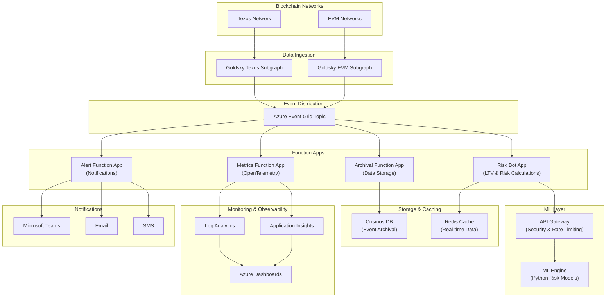

# vv-chain-services

Blockchain integration and event processing services for the VeritasVault.ai platform.

## 🔍 Overview

This repository contains the event-driven microservices responsible for ingesting, processing, analyzing, and archiving blockchain event data from Tezos and EVM networks. It is part of the VeritasVault.ai platform and is tightly integrated with Goldsky, Azure Event Grid, and a distributed risk intelligence engine powered by Python-based ML.

The solution is designed with resilience, observability, and modularity in mind — allowing independent teams to scale risk models, extend observability, or hook in new event sources with minimal friction.

## 📚 Table of Contents

- [🔧 Chain and Services Architecture](#-chain-and-services-architecture)
- [🏗️ Development Environment](#-development-environment)
- [📂 Repository Structure](#-repository-structure)
- [📀 Data Flow Overview](#-data-flow-overview)
- [⚙️ Running the Project Locally](#-running-the-project-locally)
- [⚖️ Azure Components](#-azure-components)
- [🎓 Use Case Handlers](#-use-case-handlers)
- [🚀 Deployment](#-deployment)
- [🧪 Testing](#-testing)
- [🔨 Goldsky Setup Notes](#-goldsky-setup-notes)
- [🌐 Security & Observability](#-security--observability)
- [♻️ Benefits](#-benefits-of-this-architecture)
- [📝 Documentation](#-documentation)
- [👥 Contributing](#-contributing)

## 🔧 Chain and Services Architecture



## 🏗️ Development Environment

This project uses Visual Studio Code Dev Containers for a consistent development experience.

### Prerequisites

- [Docker Desktop](https://www.docker.com/products/docker-desktop)
- [Visual Studio Code](https://code.visualstudio.com/)
- [Remote - Containers extension](https://marketplace.visualstudio.com/items?itemName=ms-vscode-remote.remote-containers)

### Getting Started

1. Clone the repository
2. Open the project in VS Code
3. When prompted, click "Reopen in Container" or run the "Remote-Containers: Reopen in Container" command
4. The container will build and set up the development environment

For more detailed information about the workspace configuration, see [WORKSPACE.md](WORKSPACE.md).

## 📂 Repository Structure

This repository follows a modular structure to support independent development and deployment of components:

```
vv-chain-services/
├── src/
│   ├── function-apps/           # Separated Function Apps for independent scaling/SLAs
│   │   ├── RiskBotApp/          # Risk calculation and ML integration
│   │   ├── MetricsFunctionApp/  # OpenTelemetry metrics publishing
│   │   ├── AlertFunctionApp/    # Notification triggers
│   │   └── ArchivalFunctionApp/ # Data storage operations
│   ├── shared/                  # Shared code and utilities
│   ├── goldsky/                 # Goldsky subgraph definitions
│   └── ml-engine/               # Python ML Engine (separate deployable unit)
└── tests/                       # C# tests for Azure Functions
```

For a complete folder structure with detailed explanations, see [FOLDER-STRUCTURE.md](FOLDER-STRUCTURE.md).

## 📀 Data Flow Overview

```
Blockchain (Tezos / EVM)
        ⬇️
    Goldsky Subgraph
        ⬇️
     [Webhook Output]
        ⬇️
Azure Event Grid Topic
        ⬇️
 +--------------------+----------------------+------------------+
 |                    |                      |                  |
 V                    V                      V                  V
Risk Bot         Metrics Bot         Alert Function      Archival Function
(Estimates, LTV) (OpenTelemetry)     (Notify, Email)     (Store to Cosmos DB)
```

## ⚙️ Running the Project Locally

### Start the ML Engine

```bash
cd src/ml-engine
uvicorn app.main:app --reload --port 8000
```

### Start the Azure Functions

```bash
# Start Risk Bot App
cd src/function-apps/RiskBotApp
func start

# Start other function apps similarly
```

Alternatively, you can use the VS Code tasks defined in the workspace:

1. Press `Ctrl+Shift+P` (or `Cmd+Shift+P` on macOS)
2. Type "Tasks: Run Task" and select it
3. Choose "Start Full Stack" to run both the ML Engine and Azure Functions

## ⚖️ Azure Components

| Component              | Purpose                                                      |
|------------------------|--------------------------------------------------------------|
| Event Grid Topic       | Central hub for blockchain event publications                |
| Event Subscriptions    | Routes Goldsky event data to various handlers                |
| Azure Function Apps    | Stateless logic (risk calculations, alert triggers)          |
| Azure Queue (optional) | Buffer layer if retries/delays are needed                    |
| Cosmos DB              | Long-term archival of structured indexed events              |
| Redis                  | Shared memory cache for downstream services                  |
| OpenTelemetry          | Unified observability for metrics, traces, and logs          |
| Azure Monitor / Log Analytics | Logs and telemetry aggregation for debugging and insight |

## 🎓 Use Case Handlers

**Risk Function App:**
- Triggers on new asset price updates
- Recalculates portfolio LTV and TVL
- Publishes to Redis for dashboard
- Communicates with ML Engine for risk analysis

**Metrics Function App:**
- Extracts event type and timing
- Publishes metrics via OpenTelemetry
- Monitors system health and performance

**Alert Function App:**
- If LTV > threshold or abnormal TXs
- Sends to Teams / Email / SMS (via Logic App)
- Handles notification throttling and aggregation

**Archival Function App:**
- Batches and stores full JSON payloads
- Writes to Cosmos DB with TTL
- Manages data partitioning and indexing

## 🚀 Deployment

### Azure Functions

```bash
cd src/function-apps/RiskBotApp
func azure functionapp publish <function-app-name>
```

### ML Engine

The ML Engine can be deployed as a container to Azure Container Apps, Azure Kubernetes Service, or Azure App Service.

```bash
cd src/ml-engine
az acr build --registry <acr-name> --image ml-engine:latest .
```

## 🧪 Testing

### .NET Tests

```bash
cd tests/RiskBotTests
dotnet test
```

### Python Tests

```bash
cd src/ml-engine
pytest
```

## 🔨 Goldsky Setup Notes

- Use `webhook` target type (POST)
- Payload format: JSON
- Use filtering logic in subgraph to minimize spam
- Include retry logic on failed webhook delivery (Goldsky handles retries)
- Include event signatures and timestamps for deduplication

## 🌐 Security & Observability

- All endpoints authenticated with Managed Identity
- Each Function App has its own Managed Identity with specific RBAC permissions
- OpenTelemetry integration for unified observability
- Event Grid Dead Letter Queue for failed delivery tracking
- Alerts routed to Security Center if abnormal spike in payloads
- Key Vault integration for secure secret management

## ♻️ Benefits of This Architecture

#### **Decoupled Processing:**
Each Function App operates independently, allowing for flexible scaling and deployment

#### **High Resilience:**
Event Grid provides reliable delivery with retries and dead letter queues

#### **Scalable:**
Can handle increasing volumes of blockchain events as the platform grows

#### **Observable:**
Comprehensive logging and monitoring throughout the pipeline

#### **Secure:**
Managed Identities and Key Vault integration for secure secret management

#### **DevOps-Friendly:**
Infrastructure as Code (Bicep) for repeatable deployments

#### **Independent Scaling:**
Each Function App can scale based on its specific workload and requirements

## 📝 Documentation

Additional documentation is available in the following files:

- [CONTRIBUTING.md](CONTRIBUTING.md) - Guidelines for contributing to the project
- [WORKSPACE.md](WORKSPACE.md) - VS Code workspace configuration and usage
- [FOLDER-STRUCTURE.md](FOLDER-STRUCTURE.md) - Detailed explanation of the repository structure

## 👥 Contributing

We welcome contributions to the vv-chain-services project! Please see [CONTRIBUTING.md](CONTRIBUTING.md) for details on our code of conduct and the process for submitting pull requests.