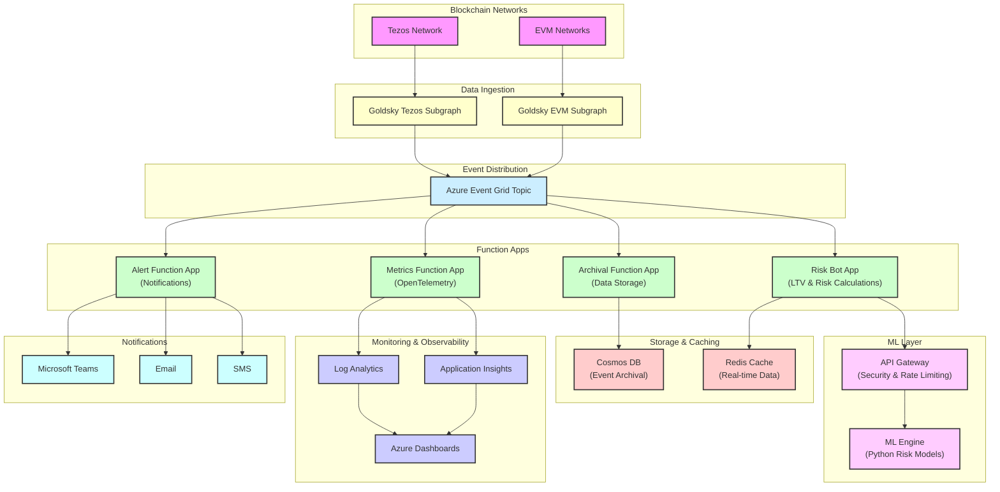

# VeritasVault Architecture Overview

## System Architecture

VeritasVault's blockchain event processing architecture is designed as a modular, event-driven system that ingests, processes, and analyzes blockchain events from multiple networks. The architecture is split between two repositories:

1. **vv-chain-services**: Core services for event processing
2. **vv-iac**: Infrastructure as Code (separate repository)

## Repository Structure

### vv-chain-services

This repository contains the application code for all services that process blockchain events:

```
vv-chain-services/
├── src/
│   ├── function-apps/           # Azure Functions (separated by domain)
│   ├── shared/                  # Shared libraries and utilities
│   ├── goldsky/                 # Blockchain indexing configuration
│   └── ml-engine/               # Risk analysis ML models
└── tests/                       # Unit and integration tests
```

### vv-iac

This repository contains all infrastructure definitions and deployment scripts:

```
vv-iac/
├── infra/
│   ├── bicep/                   # Azure infrastructure templates
│   └── scripts/                 # Deployment automation
└── tests/                       # Infrastructure tests
```

## Core Components


## Chain and Services Architecture




### 1. Data Ingestion Layer

- **Goldsky Subgraphs**: Index and transform blockchain events
  - Tezos subgraph for FA2 tokens and vaults
  - EVM subgraph for ERC-20 tokens and vaults
  - Webhook output to Azure Event Grid

### 2. Event Distribution Layer

- **Azure Event Grid**: Central hub for event distribution
  - Topic-based routing to appropriate function apps
  - Dead-letter queue for failed deliveries
  - Event filtering capabilities

### 3. Processing Layer (Function Apps)

- **Risk Bot App**: 
  - Calculates Loan-to-Value (LTV) ratios
  - Evaluates Total Value Locked (TVL)
  - Communicates with ML Engine for risk scoring

- **Metrics Function App**:
  - Publishes OpenTelemetry metrics
  - Tracks system health and performance
  - Enables real-time monitoring

- **Alert Function App**:
  - Triggers notifications based on thresholds
  - Routes alerts to appropriate channels
  - Handles notification throttling

- **Archival Function App**:
  - Stores event data in Cosmos DB
  - Manages data partitioning and indexing
  - Implements TTL policies

### 4. Machine Learning Layer

- **API Gateway**:
  - Secures ML Engine access
  - Implements rate limiting
  - Provides authentication and authorization

- **ML Engine**:
  - Python-based risk models
  - FastAPI endpoints
  - Containerized deployment

### 5. Storage & Caching Layer

- **Cosmos DB**:
  - Long-term event archival
  - Queryable event history
  - Multi-region replication

- **Redis Cache**:
  - Real-time data access
  - Shared memory for downstream services
  - Performance optimization

### 6. Monitoring & Observability

- **Application Insights**:
  - Distributed tracing
  - Exception tracking
  - Performance monitoring

- **Log Analytics**:
  - Centralized logging
  - Query capabilities
  - Alert generation

## Key Design Principles

1. **Separation of Concerns**:
   - Each Function App has a single responsibility
   - Infrastructure and application code are separated

2. **Event-Driven Architecture**:
   - Asynchronous communication via events
   - Loose coupling between components
   - Scalable processing model

3. **Independent Deployment**:
   - Separate CI/CD pipelines for each component
   - Ability to deploy and scale components independently
   - Minimized deployment risk

4. **Defense in Depth**:
   - API Gateway for ML Engine security
   - Managed Identities for authentication
   - Key Vault for secret management

5. **Observability First**:
   - Comprehensive logging and monitoring
   - OpenTelemetry integration
   - Real-time dashboards

## Data Flow

1. Blockchain events are captured by Goldsky subgraphs
2. Events are sent via webhook to Azure Event Grid
3. Event Grid routes events to appropriate Function Apps
4. Function Apps process events and:
   - Calculate risk metrics (Risk Bot)
   - Publish telemetry (Metrics Bot)
   - Trigger notifications (Alert Bot)
   - Archive data (Archival Bot)
5. Risk Bot communicates with ML Engine via API Gateway
6. Results are stored in Redis for real-time access
7. Historical data is archived in Cosmos DB

## Security Considerations

- All endpoints are authenticated with Azure AD or Managed Identity
- API Gateway provides additional security for ML Engine
- Secrets are stored in Azure Key Vault
- Network security groups restrict access
- RBAC is implemented for all resources

## Scalability

- Function Apps scale independently based on event volume
- Cosmos DB provides auto-scaling for storage
- Redis Cache handles high-throughput real-time data
- Event Grid manages event distribution at scale

## Disaster Recovery

- Geo-redundant storage for critical data
- Multi-region deployment capability
- Dead-letter queues for failed event processing
- Automated recovery procedures

## Future Enhancements

1. **Multi-Network Expansion**:
   - Add support for additional blockchain networks
   - Implement cross-chain analytics

2. **Advanced ML Capabilities**:
   - Anomaly detection for suspicious transactions
   - Predictive analytics for market movements

3. **Enhanced Observability**:
   - Business metrics dashboards
   - Real-time analytics portal

4. **Performance Optimizations**:
   - Caching strategies for frequent queries
   - Batch processing for high-volume events
