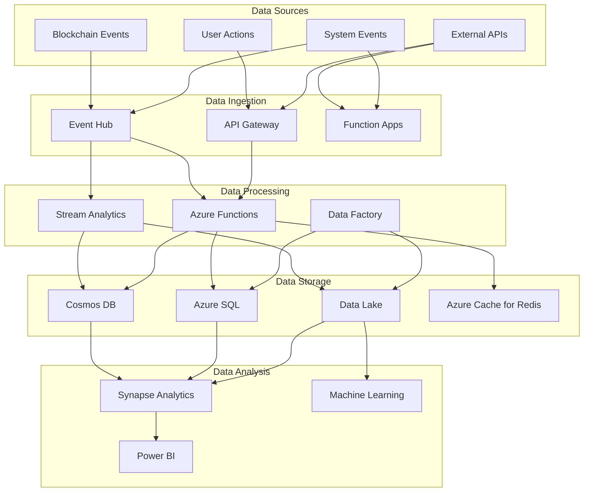

## Operational Considerations (continued)

### Incident Management

The platform implements a structured incident management process:

1. **Detection**:
   - Automated alerts from Azure Monitor
   - User-reported issues via support channels
   - Proactive monitoring by operations team

2. **Classification**:
   - Severity based on user impact and scope
   - Priority based on business impact
   - Type based on affected components

3. **Response**:
   - Predefined response playbooks by incident type
   - Automated initial response where possible
   - Escalation paths for each severity level

4. **Resolution**:
   - Immediate mitigation steps
   - Root cause analysis
   - Permanent fix implementation
   - Documentation and knowledge sharing

### Change Management

Changes to the production environment follow a structured process:

1. **Request**:
   - Formal change request with justification
   - Impact assessment and rollback plan
   - Testing evidence and validation results

2. **Review**:
   - Technical review by architecture team
   - Security review for security-impacting changes
   - Business approval for user-impacting changes

3. **Implementation**:
   - Scheduled maintenance windows
   - Automated deployment through CI/CD
   - Validation of successful implementation

4. **Verification**:
   - Post-implementation testing
   - Monitoring for unexpected impacts
   - User feedback collection

### Capacity Planning

The platform uses a data-driven approach to capacity planning:

1. **Usage Monitoring**:
   - Track resource utilization trends
   - Monitor growth patterns
   - Identify usage spikes and patterns

2. **Forecasting**:
   - Predict future resource needs
   - Plan for business growth
   - Account for seasonal variations

3. **Scaling Thresholds**:
   - Define scaling triggers
   - Set buffer capacities
   - Implement predictive scaling

## Function App Architecture

### Event-Driven Processing

The platform uses Azure Functions for event-driven processing:

1. **Event Sources**:
   - Event Grid: System events and custom topics
   - Service Bus: Reliable message processing
   - Event Hub: High-volume event ingestion
   - Cosmos DB: Database change feed

2. **Function Types**:
   - HTTP Triggers: API endpoints
   - Timer Triggers: Scheduled tasks
   - Event Triggers: Event-driven processing
   - Blob Triggers: File processing

3. **Processing Patterns**:
   - Fan-out: Distribute work across multiple functions
   - Aggregation: Combine results from multiple sources
   - Filtering: Process only relevant events
   - Transformation: Convert between formats

### Function App Organization

Functions are organized into logical groups:

| Function App | Purpose | Triggers | Dependencies |
|-------------|---------|----------|--------------|
| vv-blockchain-events | Process blockchain events | Event Grid, Timer | Cosmos DB, Service Bus |
| vv-user-operations | Handle user requests | HTTP, Service Bus | SQL Database, Key Vault |
| vv-risk-processing | Calculate risk metrics | Timer, Event Grid | Cosmos DB, ML Services |
| vv-notifications | Send user notifications | Service Bus, Event Grid | EtherMail API, Redis |
| vv-data-processing | Process and transform data | Blob, Cosmos DB | Storage, Event Hub |

### Durable Functions

The platform uses Durable Functions for complex workflows:

1. **Orchestration Patterns**:
   - Function Chaining: Sequential execution
   - Fan-out/Fan-in: Parallel processing
   - Async HTTP APIs: Long-running operations
   - Monitoring: Polling for status changes

2. **Key Workflows**:
   - Multi-chain transaction processing
   - Risk assessment workflows
   - User verification processes
   - Data aggregation pipelines

## Container Apps Architecture

### Microservices Design

The platform uses Azure Container Apps for microservices:

1. **Service Organization**:
   - Domain-driven design
   - Bounded contexts
   - Single responsibility principle
   - Independent deployment

2. **Container Design**:
   - Minimal container images
   - Sidecar patterns where appropriate
   - Health checks and readiness probes
   - Graceful shutdown handling

3. **Scaling Configuration**:
   - HTTP scaling rules
   - Event-driven scaling
   - Minimum and maximum replicas
   - Scale to zero for cost optimization

### Key Microservices

| Service | Purpose | Scaling Trigger | Dependencies |
|---------|---------|----------------|--------------|
| vv-api-gateway | API routing and aggregation | HTTP requests | None |
| vv-user-service | User management | HTTP requests | SQL Database |
| vv-vault-service | Vault operations | HTTP requests, Events | Blockchain Connectors |
| vv-risk-service | Risk calculations | Events | ML Services, Data Lake |
| vv-analytics-service | Analytics processing | Events | Data Lake, Cosmos DB |

## Data Architecture

### Data Storage Strategy

The platform uses a polyglot persistence approach:

1. **Cosmos DB**:
   - Blockchain event data
   - User activity logs
   - Real-time analytics data
   - Configuration data

2. **Azure SQL**:
   - User account data
   - Transaction records
   - Financial data
   - Audit logs

3. **Azure Storage**:
   - Document storage
   - Media files
   - Data exports
   - Backup archives

4. **Azure Cache for Redis**:
   - Session data
   - Frequently accessed data
   - Rate limiting counters
   - Distributed locks

### Data Flow Architecture

### Data Governance

The platform implements comprehensive data governance:

1. **Data Classification**:
   - Public: Non-sensitive data
   - Internal: Business data
   - Confidential: Sensitive business data
   - Restricted: Highly sensitive data

2. **Data Lifecycle Management**:
   - Creation: Data validation and classification
   - Storage: Appropriate security controls
   - Usage: Access controls and monitoring
   - Archival: Retention policies
   - Deletion: Secure data disposal

3. **Data Quality Management**:
   - Validation rules
   - Consistency checks
   - Completeness monitoring
   - Accuracy verification

## Security Implementation

### Defense in Depth

The platform implements multiple security layers:

1. **Physical Security**:
   - Azure data center security
   - Geo-redundant deployments
   - Physical access controls

2. **Network Security**:
   - Virtual networks and subnets
   - Network security groups
   - DDoS protection
   - Web application firewall

3. **Identity Security**:
   - Azure Active Directory
   - Multi-factor authentication
   - Conditional access policies
   - Just-in-time access

4. **Application Security**:
   - Secure development lifecycle
   - Dependency scanning
   - Static code analysis
   - Dynamic application security testing

5. **Data Security**:
   - Encryption at rest
   - Encryption in transit
   - Key management
   - Data loss prevention

### Security Monitoring

The platform uses comprehensive security monitoring:

1. **Azure Security Center**:
   - Security posture assessment
   - Vulnerability management
   - Threat protection
   - Regulatory compliance

2. **Azure Sentinel**:
   - Security information and event management (SIEM)
   - Security orchestration and response (SOAR)
   - Threat intelligence
   - User and entity behavior analytics

3. **Custom Security Monitoring**:
   - Blockchain-specific threat detection
   - Smart contract vulnerability monitoring
   - Wallet activity monitoring
   - Transaction pattern analysis

## Cost Management

### Cost Allocation

The platform uses a structured approach to cost allocation:

1. **Resource Tagging**:
   - Environment: dev, test, staging, prod
   - Department: engineering, marketing, etc.
   - Application: component name
   - Cost Center: financial tracking code

2. **Subscription Organization**:
   - Production subscription
   - Non-production subscription
   - Development subscription
   - Sandbox subscription

3. **Budget Management**:
   - Monthly budget allocation
   - Cost trend analysis
   - Anomaly detection
   - Forecast modeling

### Cost Optimization Techniques

The platform implements several cost optimization techniques:

1. **Automated Scaling**:
   - Scale out during peak periods
   - Scale in during off-peak hours
   - Scale to zero for dev/test environments

2. **Resource Lifecycle Management**:
   - Automated shutdown of non-production resources
   - Cleanup of unused resources
   - Right-sizing recommendations
   - Reserved instance coverage

3. **Storage Optimization**:
   - Tiered storage for infrequently accessed data
   - Data lifecycle management
   - Compression and deduplication
   - Retention policy enforcement

## Compliance and Governance

### Regulatory Compliance

The platform is designed to meet multiple regulatory requirements:

1. **Financial Regulations**:
   - Anti-Money Laundering (AML)
   - Know Your Customer (KYC)
   - Payment Card Industry (PCI)
   - Sarbanes-Oxley Act (SOX)

2. **Data Protection**:
   - General Data Protection Regulation (GDPR)
   - California Consumer Privacy Act (CCPA)
   - Personal Information Protection and Electronic Documents Act (PIPEDA)
   - Data residency requirements

3. **Industry Standards**:
   - ISO 27001 (Information Security)
   - SOC 2 (Service Organization Control)
   - NIST Cybersecurity Framework
   - Cloud Security Alliance (CSA)

### Governance Controls

The platform implements several governance controls:

1. **Policy Enforcement**:
   - Azure Policy definitions
   - Initiative definitions
   - Compliance reporting
   - Remediation tasks

2. **Access Reviews**:
   - Periodic access reviews
   - Privilege attestation
   - Role assignment validation
   - Separation of duties enforcement

3. **Audit Logging**:
   - Comprehensive activity logs
   - Administrative action tracking
   - Resource modification history
   - Access attempt monitoring

## Deployment Automation

### Infrastructure as Code

The platform uses infrastructure as code for all resources:

1. **ARM Templates**:
   - Parameterized templates
   - Linked templates for modularity
   - Template specs for reusability
   - Deployment scripts for complex scenarios

2. **Bicep**:
   - Modular resource definitions
   - Environment-specific configurations
   - Reusable modules
   - Simplified syntax

3. **Terraform**:
   - Multi-cloud resources
   - State management
   - Module organization
   - Provider configuration

### CI/CD Pipelines

The platform uses automated pipelines for all deployments:

1. **Build Pipelines**:
   - Source code compilation
   - Unit testing
   - Code quality analysis
   - Artifact creation

2. **Release Pipelines**:
   - Environment-specific deployment
   - Approval gates
   - Automated testing
   - Rollback mechanisms

3. **Infrastructure Pipelines**:
   - Infrastructure validation
   - Incremental deployment
   - Dependency management
   - State verification

## Future Roadmap

### Planned Enhancements

1. **Advanced Analytics**:
   - Real-time analytics with Azure Stream Analytics
   - Predictive analytics with Azure Machine Learning
   - Advanced visualization with Power BI
   - AI-driven insights with Cognitive Services

2. **Enhanced Security**:
   - Azure Confidential Computing
   - Advanced threat protection
   - Automated security remediation
   - Zero Trust implementation

3. **Performance Optimization**:
   - Premium tier services for critical components
   - Global distribution for reduced latency
   - Advanced caching strategies
   - Performance-focused architecture review

### Emerging Technologies

1. **Blockchain Integration**:
   - Enhanced Azure Blockchain Service integration
   - Multi-chain support expansion
   - Layer 2 scaling solutions
   - Cross-chain interoperability

2. **AI and ML Integration**:
   - Automated risk assessment
   - Anomaly detection
   - Predictive maintenance
   - Natural language processing for support

3. **Edge Computing**:
   - Azure Edge Zones for reduced latency
   - IoT integration for physical security
   - Edge processing for real-time analytics
   - Hybrid cloud-edge architecture

## References

- [Azure Architecture Center](https://docs.microsoft.com/azure/architecture/)
- [Azure Well-Architected Framework](https://docs.microsoft.com/azure/architecture/framework/)
- [Azure Security Documentation](https://docs.microsoft.com/azure/security/)
- [Azure DevOps Documentation](https://docs.microsoft.com/azure/devops/)
- [Azure Monitoring Documentation](https://docs.microsoft.com/azure/azure-monitor/)
- [Azure Compliance Documentation](https://docs.microsoft.com/azure/compliance/)
- [Azure Cost Management Documentation](https://docs.microsoft.com/azure/cost-management-billing/)
- [Azure Functions Documentation](https://docs.microsoft.com/azure/azure-functions/)
- [Azure Container Apps Documentation](https://docs.microsoft.com/azure/container-apps/)
