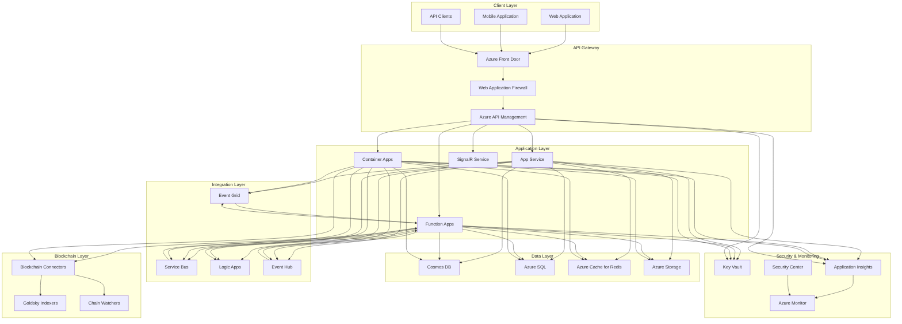

# Azure Infrastructure Guide

## Overview

The VeritasVault.ai platform is built on Azure's cloud infrastructure, providing scalability, security, and reliability. This guide covers the Azure architecture, deployment patterns, and operational considerations for the platform.

## Infrastructure Architecture

## Core Components

### API Gateway Layer

- **Azure Front Door**: Global entry point with CDN capabilities
- **Web Application Firewall**: Protection against common web vulnerabilities
- **API Management**: API versioning, documentation, and throttling

### Application Layer

- **App Service**: Hosts main web applications and APIs
- **Function Apps**: Event-driven serverless compute
- **Container Apps**: Container-based microservices
- **SignalR Service**: Real-time communications

### Data Layer

- **Cosmos DB**: Multi-model NoSQL database for blockchain data
- **Azure SQL**: Relational database for transactional data
- **Azure Cache for Redis**: High-performance caching
- **Azure Storage**: Blob, file, and queue storage

### Integration Layer

- **Event Grid**: Event routing between services
- **Service Bus**: Message queuing and reliable messaging
- **Logic Apps**: Workflow automation and integration
- **Event Hub**: Big data streaming and event ingestion

### Blockchain Layer

- **Blockchain Connectors**: Custom connectors to blockchain networks
- **Goldsky Indexers**: Integration with Goldsky indexing services
- **Chain Watchers**: Custom blockchain monitoring services

### Security & Monitoring

- **Key Vault**: Secure storage for secrets and certificates
- **Application Insights**: Application performance monitoring
- **Security Center**: Security posture management
- **Azure Monitor**: Comprehensive monitoring solution

## Deployment Architecture

The platform uses a multi-environment deployment architecture:

### Environment Structure

| Environment | Purpose | Scaling | Data Retention |
|------------|---------|---------|---------------|
| Development | Feature development | Minimal | 7 days |
| Testing | Integration testing | Moderate | 14 days |
| Staging | Pre-production validation | Production-like | 30 days |
| Production | Live system | Full scale | Indefinite |

### Resource Groups

Resources are organized into logical groups:

- **vv-core-{env}**: Core platform services
- **vv-data-{env}**: Data storage services
- **vv-integration-{env}**: Integration services
- **vv-blockchain-{env}**: Blockchain connectors
- **vv-monitoring-{env}**: Monitoring services
- **vv-security-{env}**: Security services

### Deployment Patterns

The platform uses several deployment patterns:

1. **Blue-Green Deployment**:
   - Maintain two identical environments
   - Deploy to inactive environment
   - Switch traffic when validated
   - Minimize downtime

2. **Feature Flags**:
   - Deploy features behind flags
   - Enable gradually for users
   - Roll back easily if issues arise
   - A/B test new features

3. **Canary Releases**:
   - Release to small percentage of users
   - Monitor for issues
   - Gradually increase percentage
   - Automated rollback on errors

## Scaling Strategy

### Horizontal Scaling

- **App Service Plans**: Auto-scale based on CPU and memory
- **Function Apps**: Consumption plan for event-driven scaling
- **Container Apps**: Scale based on HTTP traffic and event load
- **Cosmos DB**: Scale throughput based on RU consumption

### Vertical Scaling

- **SQL Database**: Scale up during peak periods
- **Redis Cache**: Increase cache size for high-volume periods
- **App Service**: Scale up for memory-intensive operations

### Regional Scaling

- **Primary Region**: East US 2
- **Secondary Region**: West US 2
- **Global Distribution**: Azure Front Door for global routing
- **Data Replication**: Geo-redundant storage and databases

## Security Architecture

### Network Security

- **Virtual Networks**: Isolated network environments
- **Network Security Groups**: Fine-grained access control
- **Private Endpoints**: Private connectivity to Azure services
- **Service Endpoints**: Secure access to Azure services

### Identity and Access

- **Azure Active Directory**: Identity management
- **Managed Identities**: Service-to-service authentication
- **Role-Based Access Control**: Fine-grained permissions
- **Conditional Access**: Context-based access policies

### Data Protection

- **Encryption at Rest**: All data encrypted in storage
- **Encryption in Transit**: TLS for all communications
- **Key Management**: Customer-managed keys in Key Vault
- **Data Masking**: Sensitive data protection

### Compliance

- **Azure Policy**: Enforce organizational standards
- **Azure Blueprints**: Compliant environment templates
- **Regulatory Compliance**: SOC, ISO, GDPR, etc.
- **Security Monitoring**: Continuous security assessment

## Disaster Recovery

### Backup Strategy

| Service | Backup Frequency | Retention | Recovery Method |
|---------|-----------------|-----------|----------------|
| SQL Database | Hourly | 35 days | Point-in-time restore |
| Cosmos DB | Continuous | 30 days | Point-in-time restore |
| App Service | Daily | 30 days | App backup restore |
| Storage | GRS replication | N/A | Geo-failover |
| Key Vault | Soft delete | 90 days | Recover deleted secrets |

### Recovery Objectives

- **Recovery Time Objective (RTO)**: 4 hours
- **Recovery Point Objective (RPO)**: 15 minutes
- **Service Level Objective (SLO)**: 99.9% availability

### Failover Strategy

1. **Database Failover**:
   - Automatic failover for SQL Database
   - Manual failover for Cosmos DB
   - Read replicas for continued read access

2. **Application Failover**:
   - Traffic Manager for regional failover
   - Front Door for global routing
   - Health probes for automatic detection

3. **Storage Failover**:
   - RA-GRS for read access during outages
   - Manual failover for write access
   - CDN for static content availability

## Cost Optimization

### Cost Management Strategies

1. **Right-sizing Resources**:
   - Match resource size to workload
   - Scale down during off-peak hours
   - Use consumption-based services where appropriate

2. **Reserved Instances**:
   - 1-year commitments for predictable workloads
   - 3-year commitments for core infrastructure
   - Hybrid benefit for Windows workloads

3. **Dev/Test Subscriptions**:
   - Use dev/test pricing for non-production
   - Shut down resources outside working hours
   - Implement auto-shutdown for VMs

### Monitoring and Optimization

- **Azure Cost Management**: Track and analyze costs
- **Azure Advisor**: Recommendations for cost optimization
- **Budgets and Alerts**: Proactive cost management
- **Tags**: Track costs by application, environment, etc.

## DevOps Integration

### CI/CD Pipelines

- **Azure DevOps**: Primary CI/CD platform
- **GitHub Actions**: Secondary CI/CD for open components
- **Infrastructure as Code**: ARM templates and Bicep
- **Release Gates**: Automated quality checks

### Monitoring and Feedback

- **Application Insights**: Application performance monitoring
- **Log Analytics**: Centralized logging
- **Dashboards**: Custom monitoring dashboards
- **Alerts**: Proactive issue notification

### Automation

- **Azure Automation**: Runbooks for routine tasks
- **Logic Apps**: Business process automation
- **Event Grid**: Event-driven automation
- **Azure Functions**: Serverless task automation

## Operational Considerations

### Monitoring Strategy

1. **Application Monitoring**:
   - Performance metrics
   - Exception tracking
   - Dependency monitoring
   - User behavior analytics

2. **Infrastructure Monitoring**:
   - Resource utilization
   - Service health
   - Capacity planning
   - Cost tracking

3. **Security Monitoring**:
   - Threat detection
   - Vulnerability assessment
   - Compliance monitoring
   - Access auditing

### Logging Strategy

- **Centralized Logging**: Log Analytics workspace
- **Structured Logging**: Consistent schema across services
- **Log Levels**: Appropriate detail for each environment
- **Log Retention**: Policy-based retention periods

### Alerting Strategy

- **Severity Levels**: Critical, High, Medium, Low
- **Alert Channels**: Email, SMS, Teams, PagerDuty
- **Escalation Paths**: Defined for each severity
- **Auto-remediation**: Automated responses where possible

## References

- [Azure Architecture Center](https://docs.microsoft.com/azure/architecture/)
- [Azure Well-Architected Framework](https://docs.microsoft.com/azure/architecture/framework/)
- [Azure Security Documentation](https://docs.microsoft.com/azure/security/)
- [Azure DevOps Documentation](https://docs.microsoft.com/azure/devops/)
- [Azure Monitoring Documentation](https://docs.microsoft.com/azure/azure-monitor/)
