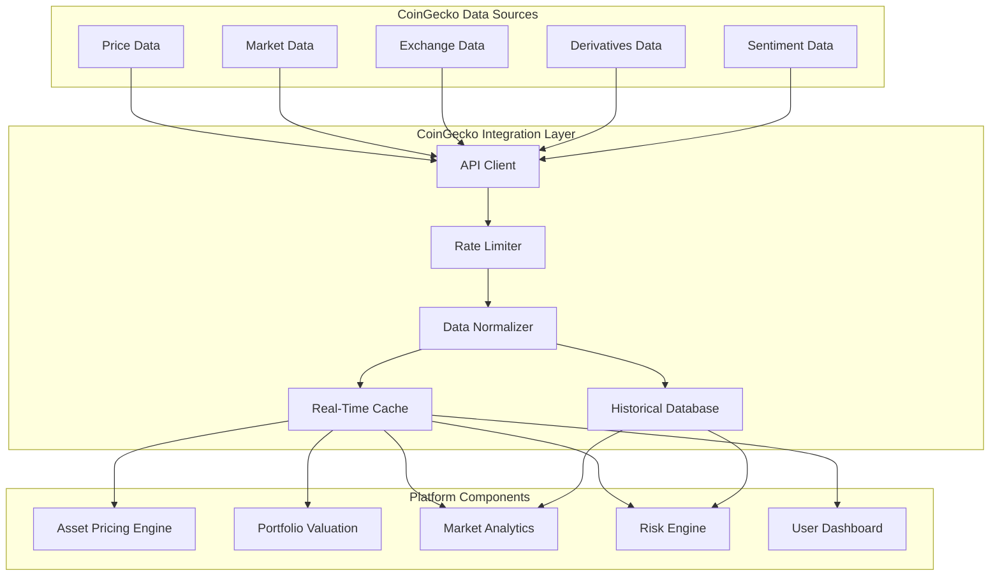

# CoinGecko Integration Documentation

## Overview

The CoinGecko integration provides comprehensive cryptocurrency market data to the VeritasVault.ai platform. This integration enables accurate asset pricing, market trend analysis, and liquidity assessment that are critical for portfolio valuation, risk management, and investment decision support.

## Key Features

- **Comprehensive Price Data**: Real-time and historical pricing for thousands of assets
- **Market Metrics**: Volume, market cap, and liquidity indicators
- **Exchange Data**: Trading pair information across centralized and decentralized exchanges
- **Derivative Markets**: Futures, options, and perpetual contract data
- **On-Chain Metrics**: Integration of on-chain data with market performance
- **Sentiment Indicators**: Market sentiment and social metrics
- **Global Market Context**: Macro indicators and market correlation data

## Architecture

## Data Sources

### Price Data

Comprehensive cryptocurrency pricing information:

- **Spot Prices**: Current market prices across exchanges
- **Historical Prices**: Price data with various time granularities
- **Price Pairs**: Prices in multiple base currencies (USD, BTC, ETH)
- **OHLC Data**: Open, high, low, close data for technical analysis
- **Price Change Metrics**: Percentage changes across time frames

### Market Data

Broader market metrics and indicators:

- **Market Capitalization**: Total and circulating supply valuations
- **Trading Volume**: 24h volume and historical volume data
- **Liquidity Metrics**: Market depth and bid-ask spreads
- **Supply Information**: Circulating, total, and max supply
- **Market Dominance**: Relative market share metrics

### Exchange Data

Information on trading venues and activity:

- **Exchange Listings**: Asset availability across exchanges
- **Trading Pairs**: Available trading pairs for assets
- **Exchange Volumes**: Volume distribution across exchanges
- **Exchange Trust Scores**: Trust and reliability metrics
- **DEX vs. CEX Data**: Comparative trading activity

### Derivatives Data

Information on cryptocurrency derivatives markets:

- **Futures Markets**: Open interest and volume for futures
- **Perpetual Swaps**: Funding rates and premium indices
- **Options Markets**: Options pricing and volume data
- **Liquidation Data**: Market-wide liquidation events
- **Basis Trading**: Spot-futures basis metrics

### Sentiment Data

Market sentiment and social metrics:

- **Developer Activity**: GitHub and development metrics
- **Social Media Metrics**: Social volume and engagement
- **Search Trends**: Interest over time from search engines
- **Community Growth**: Community size and growth metrics
- **Sentiment Analysis**: Positive/negative sentiment indicators

## Integration Components

### API Client

Handles communication with CoinGecko API:

- **Authentication**: API key management and authentication
- **Endpoint Routing**: Directs requests to appropriate endpoints
- **Request Formation**: Constructs properly formatted API requests
- **Response Parsing**: Extracts relevant data from responses
- **Error Handling**: Manages API errors and exceptions

### Rate Limiter

Manages API request frequency to comply with rate limits:

- **Request Scheduling**: Spaces requests to meet rate limits
- **Priority Queuing**: Prioritizes critical data requests
- **Burst Management**: Handles request bursts appropriately
- **Quota Tracking**: Monitors remaining API quota
- **Plan Management**: Adapts to different API plan limitations

### Data Normalizer

Standardizes data formats for platform consumption:

- **Schema Standardization**: Converts to platform data schema
- **Asset Identifier Mapping**: Maps CoinGecko IDs to platform IDs
- **Unit Conversion**: Standardizes units and currencies
- **Data Validation**: Validates data integrity and quality
- **Enrichment**: Adds derived metrics and contextual data

### Real-Time Cache

Provides high-performance access to current market data:

- **Tiered Caching**: Multiple cache levels by data criticality
- **TTL Management**: Time-to-live settings by data volatility
- **Invalidation Strategy**: Smart cache invalidation rules
- **Memory Optimization**: Efficient memory usage
- **High Availability**: Redundant cache design

### Historical Database

Stores long-term market data for analysis:

- **Time Series Storage**: Optimized for time series data
- **Data Compression**: Efficient storage of historical data
- **Aggregation Layers**: Pre-aggregated data for common queries
- **Retention Policies**: Tiered data retention strategy
- **Query Optimization**: Indexed for analytical queries

## Use Cases

### Asset Pricing and Valuation

Accurate and timely asset valuation:

1. **Portfolio Valuation**:
   - Real-time portfolio value calculation
   - Historical performance tracking
   - Multi-currency valuation options
   - Custom time period analysis

2. **NAV Calculation**:
   - Net Asset Value calculations for funds
   - Price discovery for illiquid assets
   - Fair value adjustments
   - Valuation time stamping

3. **Performance Attribution**:
   - Asset-level performance breakdown
   - Benchmark comparison
   - Alpha and beta calculations
   - Risk-adjusted return metrics

4. **Tax Reporting Support**:
   - Historical price lookups for tax events
   - Cost basis calculations
   - Realized/unrealized gain separation
   - Multi-jurisdiction support

### Market Analysis

Comprehensive market intelligence:

1. **Market Trend Analysis**:
   - Sector rotation identification
   - Momentum analysis
   - Trend strength indicators
   - Correlation studies

2. **Volatility Analysis**:
   - Historical volatility calculations
   - Volatility comparison across assets
   - Volatility regime detection
   - Volatility forecasting

3. **Liquidity Assessment**:
   - Market depth analysis
   - Slippage estimation
   - Liquidity concentration metrics
   - Exchange liquidity comparison

4. **Anomaly Detection**:
   - Price anomaly identification
   - Volume spike detection
   - Correlation breakdown alerts
   - Market structure change detection

### Risk Management

Enhanced risk assessment capabilities:

1. **Market Risk Quantification**:
   - Value at Risk (VaR) calculations
   - Expected shortfall metrics
   - Stress testing scenarios
   - Tail risk assessment

2. **Correlation Analysis**:
   - Dynamic correlation matrices
   - Diversification benefit quantification
   - Correlation regime detection
   - Contagion path identification

3. **Liquidity Risk Assessment**:
   - Exit liquidity estimation
   - Position sizing recommendations
   - Market impact modeling
   - Liquidation risk evaluation

4. **Volatility Risk Management**:
   - Volatility forecasting
   - Volatility surface analysis
   - Implied vs. realized volatility comparison
   - Volatility-based position sizing

### Investment Decision Support

Data-driven investment insights:

1. **Market Opportunity Identification**:
   - Relative value analysis
   - Momentum screening
   - Mean reversion opportunities
   - Arbitrage identification

2. **Timing Indicators**:
   - Market cycle positioning
   - Overbought/oversold indicators
   - Volume profile analysis
   - Market sentiment indicators

3. **Comparative Analysis**:
   - Peer group comparison
   - Sector performance analysis
   - Risk-adjusted return ranking
   - Value metrics comparison

4. **Scenario Analysis**:
   - Historical scenario modeling
   - Custom scenario creation
   - Probability-weighted outcomes
   - Sensitivity analysis

## Implementation Details

### API Integration

The integration leverages CoinGecko's API:

1. **Core Endpoints**:
   - `/coins/{id}`: Detailed coin information
   - `/coins/markets`: List of coins with market data
   - `/simple/price`: Simple price data
   - `/coins/{id}/market_chart`: Historical market data
   - `/exchanges`: Exchange information
   - `/derivatives`: Derivatives market data

2. **Request Parameters**:
   - Currency specification
   - Time range parameters
   - Data inclusion options
   - Pagination parameters

3. **Response Handling**:
   - JSON parsing and validation
   - Error handling and recovery
   - Rate limit management
   - Data transformation

### Data Update Strategy

Optimized data refresh strategy:

1. **Tiered Update Frequency**:
   | Data Type | Update Frequency | Rationale |
   |-----------|------------------|-----------|
   | Core Price Data | 1 minute | Critical for real-time valuation |
   | Market Metrics | 5 minutes | Important but less volatile |
   | Exchange Data | 15 minutes | Relatively stable information |
   | Derivatives Data | 5 minutes | Important for risk assessment |
   | Sentiment Data | 30 minutes | Slower-changing metrics |

2. **Event-Based Updates**:
   - Market volatility triggers more frequent updates
   - User dashboard views trigger targeted refreshes
   - Portfolio rebalancing events trigger comprehensive updates

3. **Batch Processing**:
   - Consolidate related data requests
   - Optimize update schedules
   - Prioritize high-impact data

### Fallback Mechanisms

Ensuring data availability during API issues:

1. **Cached Data Strategy**:
   - Serve cached data with freshness indicators
   - Extend cache lifetime during outages
   - Progressive data staleness handling

2. **Alternative Data Sources**:
   - Secondary price data providers
   - Exchange-direct API fallbacks
   - On-chain oracle data where applicable

3. **Graceful Degradation**:
   - Core vs. enhanced data distinction
   - Transparent data source attribution
   - Clear freshness indicators

### Data Processing Pipeline

The flow of data through the system:

1. **Data Acquisition**:
   - Scheduled API polling
   - Webhook-based updates where available
   - Bulk historical data imports

2. **Data Transformation**:
   - Normalization to standard formats
   - Enrichment with derived metrics
   - Anomaly detection and flagging

3. **Data Storage**:
   - Real-time cache for current data
   - Time-series database for historical data
   - Data warehouse for analytical queries

4. **Data Distribution**:
   - Push-based updates for dashboards
   - Query-based access for analytics
   - Subscription-based alerts

## Dashboard Integration

### Market Data Dashboard

Comprehensive market intelligence display:

1. **Market Overview**:
   - Global market metrics
   - Sector performance heatmap
   - Volume distribution visualization
   - Market dominance charts

2. **Asset Detail Views**:
   - Price charts with multiple timeframes
   - Volume profile analysis
   - Exchange distribution breakdown
   - Correlation network visualization

3. **Technical Analysis Tools**:
   - Moving averages and indicators
   - Support/resistance identification
   - Volatility analysis
   - Pattern recognition

### Portfolio Context

Contextualizing portfolio holdings:

1. **Holdings Valuation**:
   - Real-time portfolio valuation
   - Performance attribution
   - Unrealized P&L tracking
   - Cost basis comparison

2. **Risk Analysis**:
   - Portfolio volatility metrics
   - Correlation heatmap
   - Concentration analysis
   - Liquidity risk assessment

3. **Performance Benchmarking**:
   - Sector benchmark comparison
   - Peer performance ranking
   - Risk-adjusted return analysis
   - Alpha generation metrics

### Market Alerts

Automated market intelligence alerts:

1. **Price Alerts**:
   - Threshold-based price alerts
   - Volatility spike notifications
   - Trend reversal signals
   - Technical pattern completions

2. **Volume Alerts**:
   - Unusual volume detection
   - Liquidity change warnings
   - Exchange anomaly alerts
   - Trading pair liquidity shifts

3. **Correlation Alerts**:
   - Correlation breakdown notifications
   - Diversification opportunity alerts
   - Sector rotation signals
   - Market regime change indicators

## Risk Engine Integration

### Price Risk Factors

Market data inputs for risk assessment:

1. **Volatility Metrics**:
   - Historical volatility calculations
   - Implied volatility where available
   - Volatility term structure
   - Volatility regime classification

2. **Correlation Factors**:
   - Dynamic correlation matrices
   - Correlation regime detection
   - Correlation stability metrics
   - Diversification ratio calculations

3. **Liquidity Risk Metrics**:
   - Market depth analysis
   - Bid-ask spread monitoring
   - Volume-based liquidity scores
   - Exchange concentration risk

### Market Stress Indicators

Early warning system for market stress:

1. **Market Dislocation Signals**:
   - Unusual price-volume relationships
   - Correlation breakdowns
   - Liquidity contraction patterns
   - Volatility regime shifts

2. **Exchange Risk Indicators**:
   - Withdrawal/deposit imbalances
   - Exchange premium disparities
   - Trading volume anomalies
   - Exchange health metrics

3. **Derivatives Market Signals**:
   - Funding rate extremes
   - Open interest anomalies
   - Liquidation cascades
   - Futures basis distortions

### Risk Scoring Inputs

CoinGecko data factors in risk scoring:

1. **Asset Risk Factors**:
   - Volatility-based risk scoring
   - Liquidity risk adjustment
   - Market capitalization factor
   - Volume profile risk

2. **Market Environment Factors**:
   - Market regime classification
   - Sentiment-based risk adjustment
   - Correlation-based systemic risk
   - Macro trend alignment

3. **Exchange Risk Factors**:
   - Exchange trust score integration
   - Trading pair liquidity factors
   - Exchange concentration risk
   - Counterparty risk assessment

## Security and Compliance

### Data Integrity

Ensuring data quality and reliability:

1. **Data Validation**:
   - Cross-exchange price validation
   - Outlier detection and handling
   - Data consistency checks
   - Source reliability weighting

2. **Audit Trail**:
   - Data provenance tracking
   - Modification logging
   - Version control for derived data
   - Change history maintenance

3. **Quality Monitoring**:
   - Data quality metrics dashboard
   - Automated anomaly detection
   - Source reliability scoring
   - Regular data quality reviews

### Compliance Considerations

Regulatory and compliance aspects:

1. **Data Usage Compliance**:
   - Adherence to CoinGecko's terms of service
   - Appropriate attribution and citations
   - Compliance with data redistribution terms

2. **Financial Information Handling**:
   - Clear disclaimers on market data
   - Data freshness transparency
   - Price source attribution
   - Accuracy limitation disclosures

3. **User Data Protection**:
   - Privacy-preserving analytics
   - Secure handling of user preferences
   - Compliance with data protection regulations
   - Anonymized usage pattern analysis

## Advanced Features

### Machine Learning Integration

Enhanced analytics through ML:

1. **Price Prediction Models**:
   - Short-term price movement forecasting
   - Volatility prediction
   - Regime change detection
   - Anomaly prediction

2. **Pattern Recognition**:
   - Automated chart pattern identification
   - Volume pattern recognition
   - Market structure change detection
   - Correlation pattern identification

3. **Sentiment Analysis**:
   - Natural language processing of news
   - Social media sentiment analysis
   - Sentiment impact modeling
   - Sentiment-based alerts

4. **Clustering and Classification**:
   - Asset clustering by behavior
   - Market regime classification
   - Volatility regime detection
   - Liquidity profile classification

### API Extensions

Extended API capabilities:

1. **Custom Endpoints**:
   - Aggregated market metrics
   - Custom index calculations
   - Risk-adjusted metrics
   - Portfolio-specific analytics

2. **Webhook Notifications**:
   - Price threshold alerts
   - Market condition notifications
   - Portfolio impact alerts
   - Risk threshold notifications

3. **Batch Operations**:
   - Multi-asset data retrieval
   - Historical data batch processing
   - Cross-metric correlation analysis
   - Portfolio-wide calculations

### Data Export and Integration

Flexible data utilization:

1. **Export Formats**:
   - CSV/Excel exports
   - JSON data feeds
   - GraphQL API access
   - Streaming data options

2. **Third-Party Tool Integration**:
   - TradingView integration
   - Excel/Google Sheets connectors
   - Tableau/PowerBI connectors
   - Custom widget embedding

3. **Notification Channels**:
   - Email notifications
   - Mobile push notifications
   - Webhook deliveries
   - Messaging platform integrations

## Performance Optimization

### Caching Strategy

Optimized data availability:

1. **Multi-Level Caching**:
   - In-memory cache for hot data
   - Distributed cache for shared data
   - Local cache for user-specific data
   - Persistent cache for historical data

2. **Cache Invalidation**:
   - Time-based invalidation
   - Event-based invalidation
   - Selective field updates
   - Hierarchical invalidation

3. **Cache Warming**:
   - Predictive cache warming
   - User-based anticipatory caching
   - Background refresh strategies
   - Critical path prioritization

### Query Optimization

Efficient data retrieval:

1. **Query Patterns**:
   - Common query optimization
   - Query result caching
   - Partial result caching
   - Query combination and batching

2. **Data Aggregation**:
   - Pre-aggregated datasets
   - Time-window aggregations
   - Progressive aggregation levels
   - Custom aggregation endpoints

3. **Selective Data Loading**:
   - Field selection optimization
   - Pagination optimization
   - Lazy loading strategies
   - Data prioritization

## Monitoring and Maintenance

### Data Quality Monitoring

Ensuring ongoing data integrity:

1. **Quality Metrics**:
   - Data freshness monitoring
   - Consistency checks
   - Completeness verification
   - Accuracy validation

2. **Anomaly Detection**:
   - Price anomaly detection
   - Volume anomaly detection
   - API response anomalies
   - Data pattern anomalies

3. **Alert System**:
   - Data quality alerts
   - API health notifications
   - Rate limit warnings
   - Source reliability alerts

### Performance Monitoring

Tracking system performance:

1. **API Performance**:
   - Response time tracking
   - Request success rates
   - Rate limit utilization
   - Endpoint performance comparison

2. **Processing Performance**:
   - Data processing latency
   - Transformation efficiency
   - Storage operation performance
   - Query performance metrics

3. **Resource Utilization**:
   - Memory usage monitoring
   - CPU utilization tracking
   - Network bandwidth utilization
   - Storage capacity management

### Maintenance Procedures

Ongoing system maintenance:

1. **Data Cleanup**:
   - Historical data archiving
   - Cache purging strategies
   - Data deduplication
   - Storage optimization

2. **API Management**:
   - API key rotation
   - Endpoint deprecation handling
   - Version migration
   - Rate limit management

3. **Schema Evolution**:
   - Data schema updates
   - Backward compatibility
   - Migration procedures
   - Version control

## Conclusion

The CoinGecko integration provides VeritasVault.ai with comprehensive market data capabilities that enhance portfolio valuation, risk assessment, and market intelligence features. By leveraging CoinGecko's extensive cryptocurrency data, the platform delivers accurate, timely, and contextually rich information to users, enabling informed decision-making in the dynamic cryptocurrency market.

The integration architecture emphasizes reliability, performance, and data quality while providing flexibility for future enhancements and extensions. Through careful attention to data processing, caching, and distribution, the integration delivers a responsive and robust market data experience that forms a critical component of the VeritasVault.ai platform.

## References

- [CoinGecko API Documentation](https://www.coingecko.com/api/documentation)
- [CoinGecko Pro API](https://www.coingecko.com/en/api/pricing)
- [CoinGecko Terms of Service](https://www.coingecko.com/en/terms)
- [VeritasVault Market Data Framework](https://docs.veritasvault.ai/market-data)
- [Cryptocurrency Market Data Best Practices](https://docs.veritasvault.ai/market-data-best-practices)
