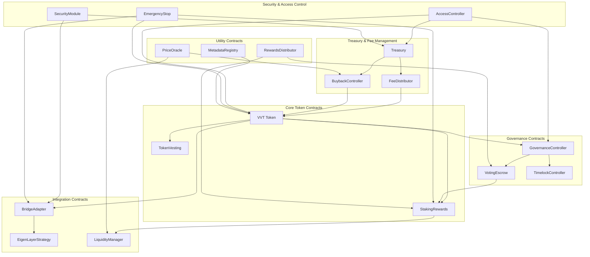

# VeritasVault Token (VVT) Smart Contract Architecture

## Overview

The VeritasVault Token (VVT) ecosystem consists of a suite of interconnected smart contracts that enable governance, staking, fee distribution, and cross-chain functionality. This document provides a comprehensive specification for each contract in the ecosystem, including their purpose, functionality, interfaces, and implementation considerations.

## Contract Architecture

## Core Token Contracts

### VVT Token Contract

**Purpose**: The VVT token is the native utility and governance token of the VeritasVault platform, enabling governance participation, fee sharing, and access to premium features.

**Key Features**:
- ERC-20 compliant token with 18 decimals
- Maximum supply of 100 million tokens
- Snapshot functionality for governance
- Pausable in case of emergencies
- Role-based access control
- Blacklist functionality for regulatory compliance
- EIP-2612 permit functionality for gasless approvals
- Upgradeable via UUPS proxy pattern

**Implementation Considerations**:
- Implement with OpenZeppelin's upgradeable contracts
- Include comprehensive events for all state changes
- Implement strict access control for admin functions
- Ensure compatibility with major DeFi protocols
- Include cross-chain transfer capabilities

### TokenVesting Contract

**Purpose**: Manages the vesting schedules for team members, investors, advisors, and other stakeholders, ensuring a controlled token distribution over time.

**Key Features**:
- Support for multiple vesting schedules per beneficiary
- Configurable cliff and vesting duration
- Linear or custom vesting curves
- Revocable vesting schedules (for team members)
- Emergency pause functionality
- Transparent vesting schedule verification

**Implementation Considerations**:
- Gas-efficient release mechanism
- Secure revocation process
- Comprehensive event logging
- Integration with governance for emergency actions
- Upgradeable design for future modifications

### StakingRewards Contract

**Purpose**: Enables token holders to stake their VVT tokens to earn rewards, including platform fees, inflationary rewards, and other incentives.

**Key Features**:
- Flexible staking periods (30, 90, 180, 365 days)
- Tiered rewards based on staking duration
- Compound interest option
- Early withdrawal penalties
- Boost mechanisms for governance participants
- Integration with voting escrow for enhanced rewards

**Implementation Considerations**:
- Efficient reward calculation algorithm
- Protection against flash loan attacks
- Secure reward distribution mechanism
- Scalable design for large numbers of stakers
- Integration with fee distribution system

## Governance Contracts

### GovernanceController Contract

**Purpose**: Manages the governance process for the VeritasVault platform, enabling token holders to propose and vote on protocol changes and parameter updates.

**Key Features**:
- Proposal creation and management
- Voting mechanisms (including delegation)
- Quorum and threshold requirements
- Timelock for execution of passed proposals
- Emergency proposal fast-tracking
- Integration with VotingEscrow for vote weighting

**Implementation Considerations**:
- Gas-efficient voting mechanism
- Secure proposal execution
- Transparent voting process
- Resistance to governance attacks
- Upgradeable design for governance evolution

### VotingEscrow Contract

**Purpose**: Implements a vote-locking mechanism similar to Curve's veCRV model, where users can lock their VVT tokens for extended periods to gain boosted voting power and rewards.

**Key Features**:
- Time-weighted voting power calculation
- Maximum lock period of 4 years
- Decay function for voting power
- Boost for staking rewards
- Non-transferable locked positions
- Early unlock penalties

**Implementation Considerations**:
- Efficient voting power calculation
- Secure lock mechanism
- Integration with staking rewards
- Checkpointing for historical voting power
- Gas optimization for frequent operations

### TimelockController Contract

**Purpose**: Adds a time delay to governance actions, providing a security buffer for users to react to potentially malicious proposals before they are executed.

**Key Features**:
- Configurable delay period
- Multi-signature requirements for critical actions
- Emergency cancellation mechanism
- Transparent pending action queue
- Role-based access control

**Implementation Considerations**:
- Secure execution mechanism
- Clear event logging
- Integration with governance controller
- Emergency override capabilities
- Upgradeable design for parameter adjustments

## Treasury & Fee Management

### Treasury Contract

**Purpose**: Manages the protocol's treasury funds, including protocol-owned liquidity, fee revenue, and strategic investments.

**Key Features**:
- Multi-signature control
- Spending limits and approvals
- Investment strategy execution
- Revenue distribution to stakeholders
- Emergency fund management
- Transparent fund allocation

**Implementation Considerations**:
- Secure multi-sig implementation
- Integration with governance for major decisions
- Comprehensive event logging
- Support for multiple asset types
- Upgradeable design for strategy evolution

### FeeDistributor Contract

**Purpose**: Collects and distributes platform fees to various stakeholders, including stakers, governance participants, treasury, and buyback mechanism.

**Key Features**:
- Fee collection from multiple sources
- Configurable distribution ratios
- Automatic distribution scheduling
- Support for multiple token types
- Integration with staking rewards
- Transparent fee accounting

**Implementation Considerations**:
- Gas-efficient distribution mechanism
- Secure fee collection process
- Integration with treasury and staking
- Support for fee-on-transfer tokens
- Upgradeable design for distribution adjustments

### BuybackController Contract

**Purpose**: Manages the automated buyback and burn mechanism for VVT tokens, creating sustainable token value through reducing circulating supply.

**Key Features**:
- Automated market operations
- Price-based trigger mechanisms
- Slippage protection
- Integration with DEX aggregators
- Transparent burn process
- Configurable buyback parameters

**Implementation Considerations**:
- MEV protection mechanisms
- Efficient DEX interaction
- Price oracle integration
- Gas optimization for frequent operations
- Upgradeable design for strategy evolution

## Integration Contracts

### BridgeAdapter Contract

**Purpose**: Enables cross-chain functionality for VVT tokens, allowing seamless transfer between supported blockchains.

**Key Features**:
- Integration with EtherLink bridge
- Support for multiple destination chains
- Fee management for cross-chain operations
- Security verification for bridge operations
- Rate limiting for risk management
- Event logging for cross-chain transfers

**Implementation Considerations**:
- Secure message verification
- Replay attack prevention
- Integration with security module
- Support for chain-specific requirements
- Upgradeable design for adding new chains

### EigenLayerStrategy Contract

**Purpose**: Integrates with EigenLayer for enhanced security through restaking, enabling VVT to participate in the broader security ecosystem.

**Key Features**:
- EigenLayer deposit management
- Reward collection and distribution
- Slashing protection mechanisms
- Delegation capabilities
- Transparent reporting of restaked amounts
- Risk management parameters

**Implementation Considerations**:
- Secure interaction with EigenLayer contracts
- Efficient reward distribution
- Clear event logging
- Integration with governance for parameter updates
- Upgradeable design for protocol evolution

### LiquidityManager Contract

**Purpose**: Manages protocol-owned liquidity across various DEXs, optimizing for depth, fees, and capital efficiency.

**Key Features**:
- Automated liquidity provision
- Fee tier optimization
- Liquidity concentration strategies
- Rebalancing mechanisms
- Integration with treasury
- Performance reporting

**Implementation Considerations**:
- Gas-efficient DEX interactions
- Slippage protection
- Integration with price oracles
- Support for multiple DEX protocols
- Upgradeable design for strategy evolution

## Security & Access Control

### AccessController Contract

**Purpose**: Provides a centralized access control system for the entire VVT ecosystem, managing roles and permissions across all contracts.

**Key Features**:
- Role-based access control
- Permission management
- Multi-signature requirements for critical actions
- Emergency access provisions
- Transparent role assignment
- Time-locked role changes

**Implementation Considerations**:
- Efficient permission checking
- Secure role management
- Comprehensive event logging
- Integration with governance
- Upgradeable design for evolving security model

### SecurityModule Contract

**Purpose**: Implements security measures to protect the VVT ecosystem from attacks and exploits, including circuit breakers and rate limiting.

**Key Features**:
- Integration with security oracles
- Circuit breaker mechanisms
- Rate limiting for sensitive operations
- Anomaly detection
- Emergency pause capabilities
- Attack mitigation strategies

**Implementation Considerations**:
- Fast response mechanisms
- Secure trigger conditions
- Clear event logging
- Integration with governance for parameter updates
- Upgradeable design for evolving security threats

### EmergencyStop Contract

**Purpose**: Provides a last-resort mechanism to pause critical system functions in case of detected vulnerabilities or attacks.

**Key Features**:
- Granular pause functionality
- Multi-signature authorization
- Timelock for resuming operations
- Transparent status reporting
- Integration with security module
- Emergency governance proposals

**Implementation Considerations**:
- Minimal attack surface
- Clear authorization checks
- Comprehensive event logging
- Integration with all critical contracts
- Non-upgradeable design for security

## Utility Contracts

### PriceOracle Contract

**Purpose**: Provides reliable price data for VVT and other relevant assets, supporting various platform functions that require price information.

**Key Features**:
- Integration with CoinGecko and DeFiLlama
- Time-weighted average price (TWAP) calculations
- Multi-source price validation
- Fallback mechanisms
- Price deviation protection
- Historical price access

**Implementation Considerations**:
- Manipulation resistance
- Efficient price updates
- Clear data sourcing
- Support for multiple price feeds
- Upgradeable design for oracle evolution

### MetadataRegistry Contract

**Purpose**: Stores and manages on-chain metadata for the VVT ecosystem, including contract addresses, version information, and configuration parameters.

**Key Features**:
- On-chain storage of token metadata
- Contract address registry
- Version tracking
- Configuration parameter storage
- Integration points for off-chain data
- Verification mechanisms for data integrity

**Implementation Considerations**:
- Gas-efficient storage patterns
- Secure update mechanisms
- Clear access control
- Support for complex data structures
- Upgradeable design for schema evolution

### RewardsDistributor Contract

**Purpose**: Manages the distribution of various rewards across the platform, including staking rewards, governance incentives, and referral bonuses.

**Key Features**:
- Support for multiple reward types
- Configurable distribution schedules
- Claim mechanisms
- Reward boosting logic
- Integration with staking and governance
- Transparent reward accounting

**Implementation Considerations**:
- Gas-efficient distribution algorithm
- Secure reward calculation
- Clear event logging
- Support for multiple token types
- Upgradeable design for reward strategy evolution

## Implementation Phases

### Phase 1: Core Infrastructure (Launch)
- VVT Token Contract
- TokenVesting Contract
- StakingRewards Contract
- GovernanceController Contract
- Treasury Contract
- AccessController Contract

### Phase 2: Ecosystem Expansion
- FeeDistributor Contract
- BridgeAdapter Contract
- SecurityModule Contract
- PriceOracle Contract
- EmergencyStop Contract
- MetadataRegistry Contract

### Phase 3: Advanced Features
- VotingEscrow Contract
- EigenLayerStrategy Contract
- LiquidityManager Contract
- BuybackController Contract
- RewardsDistributor Contract
- TimelockController Contract

## Security Considerations

### Audit Strategy
- Multiple independent audits from reputable firms
- Formal verification for critical functions
- Bug bounty program
- Gradual deployment with value caps
- Comprehensive test coverage (>95%)

### Risk Mitigation
- Emergency pause mechanisms
- Upgradeable contracts with timelock
- Multi-signature requirements for critical actions
- Rate limiting and circuit breakers
- Transparent event logging for all state changes

### Upgradeability
- UUPS proxy pattern for upgradeable contracts
- Transparent upgrade process through governance
- Comprehensive upgrade testing framework
- Timelock for upgrade operations
- Backward compatibility considerations

## Gas Optimization

### Storage Patterns
- Efficient storage packing
- Minimal storage operations
- Use of immutable variables where appropriate
- Batch operations for multiple updates
- Optimized data structures for common operations

### Execution Efficiency
- Function optimization for common paths
- Minimized external calls
- Use of view functions for read-only operations
- Gas-efficient loops and iterations
- Optimized event emission

## Cross-Chain Compatibility

### Supported Chains
- Ethereum Mainnet (Primary)
- Optimism
- Arbitrum
- Base
- Solana (via wormhole)

### Bridge Security
- Message verification and validation
- Rate limiting for cross-chain transfers
- Replay attack prevention
- Slippage protection for wrapped tokens
- Emergency bridge shutdown capability

## Conclusion

The VVT token ecosystem provides a comprehensive foundation for the VeritasVault platform, enabling governance, staking, fee distribution, and cross-chain functionality. The modular design allows for phased implementation and future expansion, while the focus on security, gas optimization, and upgradeability ensures long-term sustainability and adaptability.

By implementing this contract architecture, VeritasVault will create a robust token ecosystem that aligns incentives between users, stakers, and governance participants, while providing the necessary infrastructure for platform growth and evolution.
