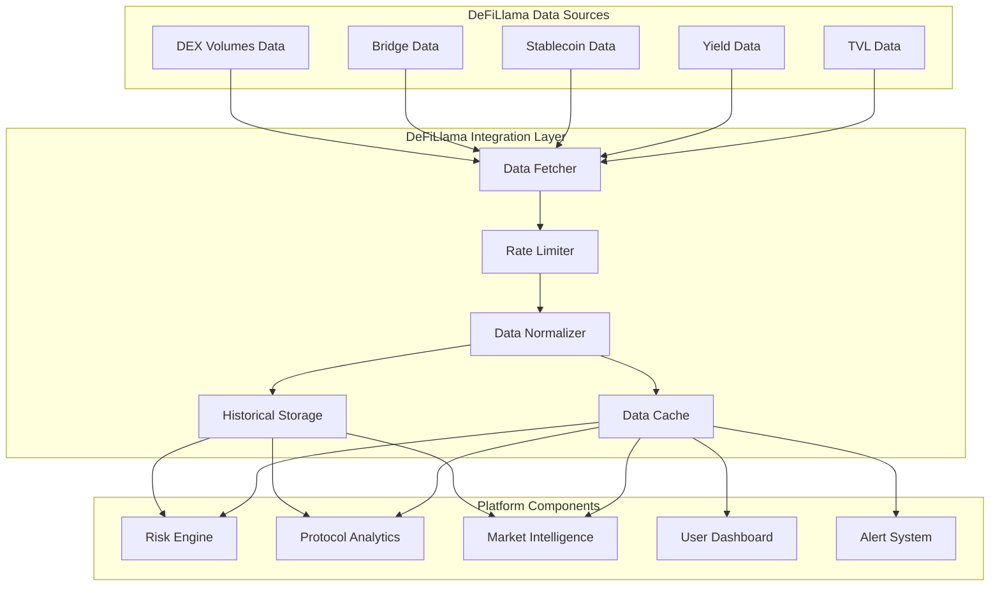

# DeFiLlama Integration Documentation

## Overview

The DeFiLlama integration provides comprehensive DeFi protocol analytics and Total Value Locked (TVL) metrics to the VeritasVault.ai platform. This integration enables risk assessment, protocol health monitoring, and market intelligence features that enhance the platform's decision-making capabilities.

## Key Features

- **Protocol TVL Tracking**: Monitor TVL across thousands of DeFi protocols
- **Chain Analytics**: Track value distribution across multiple blockchains
- **Yield Farming Data**: Access yield opportunities and historical performance
- **Protocol Health Metrics**: Monitor key indicators of protocol stability
- **Historical Data Analysis**: Analyze trends and patterns in DeFi ecosystems
- **Market Share Analysis**: Track protocol dominance and market share shifts
- **Cross-Chain Comparisons**: Compare metrics across different blockchains

## Architecture

## Data Sources

### TVL Data

Total Value Locked metrics across the DeFi ecosystem:

- **Protocol-Level TVL**: Value locked in individual protocols
- **Chain-Level TVL**: Value locked across different blockchains
- **Historical TVL**: TVL changes over time
- **Token Distribution**: Breakdown of assets locked in protocols

### Yield Data

Comprehensive yield farming opportunities:

- **Pool APY/APR**: Current and historical yield rates
- **Pool Composition**: Asset composition of liquidity pools
- **Pool Size**: Total value in yield-generating pools
- **Reward Tokens**: Information on reward token distribution

### Stablecoin Data

Stablecoin metrics and analytics:

- **Stablecoin Market Caps**: Total supply of major stablecoins
- **Peg Stability**: Tracking of stablecoin peg maintenance
- **Chain Distribution**: Stablecoin distribution across chains
- **Backing Information**: Data on collateralization where available

### Bridge Data

Cross-chain bridge analytics:

- **Bridge TVL**: Value locked in cross-chain bridges
- **Bridge Volume**: Transaction volume across bridges
- **Bridge Security**: Security metrics for bridge protocols
- **Chain Connectivity**: Network of connected blockchains

### DEX Volumes Data

Decentralized exchange activity metrics:

- **Trading Volumes**: Volume data across major DEXs
- **Fee Generation**: Protocol fee generation metrics
- **Liquidity Depth**: Market depth across trading pairs
- **Volume Distribution**: Volume breakdown by token pairs

## Integration Components

### Data Fetcher

Responsible for retrieving data from DeFiLlama APIs:

- **Endpoint Management**: Handles multiple API endpoints
- **Request Formatting**: Prepares API requests
- **Response Handling**: Processes API responses
- **Error Management**: Handles API errors and timeouts
- **Retry Logic**: Implements intelligent retry strategies

### Rate Limiter

Manages API request frequency to prevent rate limiting:

- **Request Queuing**: Queues requests to meet rate limits
- **Priority Management**: Prioritizes critical data requests
- **Adaptive Throttling**: Adjusts request rates based on API responses
- **Usage Tracking**: Monitors API usage against limits
- **Batch Processing**: Combines requests where possible

### Data Normalizer

Standardizes data formats for platform consumption:

- **Schema Mapping**: Maps DeFiLlama schemas to platform schemas
- **Unit Conversion**: Standardizes value units
- **Identifier Resolution**: Resolves protocol and token identifiers
- **Data Enrichment**: Adds additional context to raw data
- **Data Validation**: Validates data integrity and consistency

### Data Cache

Provides high-performance access to recent data:

- **Tiered Caching**: Multiple cache levels based on data criticality
- **Invalidation Strategy**: Smart cache invalidation based on data volatility
- **Cache Warming**: Proactive caching of frequently accessed data
- **Memory Optimization**: Efficient memory usage for cached data
- **Cache Statistics**: Monitoring of cache performance

### Historical Storage

Maintains long-term historical data for analysis:

- **Time Series Storage**: Efficient storage of time series data
- **Data Compression**: Optimized storage format for historical data
- **Retention Policies**: Configurable data retention periods
- **Aggregation Logic**: Pre-aggregated data for common time frames
- **Query Optimization**: Indexed data for efficient historical queries

## Use Cases

### Risk Assessment

DeFiLlama data enhances risk assessment capabilities:

1. **Protocol Concentration Risk**:
   - Monitor TVL concentration across protocols
   - Track changes in protocol dominance
   - Identify overexposure to specific protocols

2. **Chain Concentration Risk**:
   - Analyze value distribution across chains
   - Monitor chain-specific risks
   - Evaluate cross-chain diversification

3. **TVL Volatility Analysis**:
   - Track sudden changes in protocol TVL
   - Identify patterns preceding security incidents
   - Detect abnormal capital flows

4. **Liquidity Risk Assessment**:
   - Evaluate liquidity depth for assets
   - Monitor liquidity trends over time
   - Identify potential liquidity constraints

### Protocol Health Monitoring

Continuous monitoring of protocol vitality:

1. **TVL Trend Analysis**:
   - Track long-term TVL trends
   - Identify growth or decline patterns
   - Compare against sector averages

2. **Protocol Activity Metrics**:
   - Monitor user activity levels
   - Track transaction volumes
   - Analyze fee generation

3. **Competitive Position**:
   - Compare protocols within categories
   - Track market share changes
   - Identify emerging competitors

4. **Yield Sustainability**:
   - Analyze yield trends over time
   - Compare yields against benchmarks
   - Identify unsustainable yield patterns

### Market Intelligence

Strategic insights from DeFi ecosystem data:

1. **Sector Analysis**:
   - Track growth across DeFi sectors
   - Identify emerging DeFi categories
   - Monitor sector rotation patterns

2. **Capital Flow Analysis**:
   - Track movement of capital between protocols
   - Identify capital flow between chains
   - Detect early signs of sector shifts

3. **Correlation Analysis**:
   - Analyze correlations between protocol metrics
   - Identify contagion paths during stress events
   - Detect diversification opportunities

4. **Trend Identification**:
   - Spot emerging trends in DeFi
   - Identify protocol innovation patterns
   - Track adoption of new DeFi primitives

## Implementation Details

### API Integration

The integration leverages DeFiLlama's public APIs:

1. **Core Endpoints**:
   - `/tvl`: Protocol TVL data
   - `/protocol/{protocol}`: Detailed protocol information
   - `/chains`: Chain-level TVL data
   - `/yields`: Yield farming opportunities
   - `/stablecoins`: Stablecoin metrics
   - `/bridges`: Bridge data and metrics
   - `/volumes`: DEX volume data

2. **Request Parameters**:
   - Time range specifications
   - Data granularity options
   - Currency conversion preferences
   - Filtering parameters

3. **Response Handling**:
   - JSON parsing and validation
   - Error handling and recovery
   - Rate limit management
   - Data transformation

### Data Update Strategy

Optimized data refresh strategy:

1. **Tiered Update Frequency**:
   | Data Type | Update Frequency | Rationale |
   |-----------|------------------|-----------|
   | TVL Data | 1 hour | Balance between freshness and API load |
   | Yield Data | 4 hours | Relatively stable over short periods |
   | Stablecoin Data | 1 hour | Important for risk monitoring |
   | Bridge Data | 2 hours | Medium volatility data |
   | Volume Data | 30 minutes | Higher volatility, trading relevance |

2. **Critical Event Triggers**:
   - Market volatility events trigger immediate updates
   - Significant TVL changes prompt out-of-cycle updates
   - User dashboard views trigger targeted refreshes

3. **Batch Processing**:
   - Consolidate related data requests
   - Optimize update schedules
   - Prioritize high-impact data

### Fallback Mechanisms

Ensuring data availability during API issues:

1. **Cached Data Fallback**:
   - Serve cached data with freshness indicators
   - Gradually extend cache lifetime during outages
   - Prioritize critical data refreshes when API recovers

2. **Alternative Data Sources**:
   - Secondary data providers for critical metrics
   - On-chain data derivation where possible
   - Synthetic data generation for short-term gaps

3. **Degraded Service Modes**:
   - Define essential vs. non-essential data
   - Implement progressive data loading
   - Provide transparency on data freshness

## Dashboard Integration

### Risk Dashboard Components

DeFiLlama data enhances risk monitoring:

1. **Protocol Risk Indicators**:
   - TVL trends with anomaly highlighting
   - Protocol dominance visualization
   - Risk score derived from multiple metrics

2. **Chain Risk Visualization**:
   - Chain distribution heatmap
   - Cross-chain exposure analysis
   - Chain-specific risk indicators

3. **Liquidity Risk Metrics**:
   - Liquidity depth visualization
   - Historical liquidity trends
   - Liquidity concentration analysis

### Market Intelligence Dashboard

Strategic insights for decision-making:

1. **DeFi Sector Map**:
   - Visual representation of DeFi ecosystem
   - Size indicators based on TVL
   - Growth trajectory indicators

2. **Trend Analysis Tools**:
   - Sector growth comparison
   - Protocol adoption curves
   - Innovation diffusion visualization

3. **Opportunity Scanner**:
   - Yield opportunity comparison
   - Risk-adjusted return analysis
   - Emerging protocol alerts

### User Portfolio Context

Contextualizing user holdings:

1. **Holdings in Context**:
   - User exposure relative to protocol TVL
   - Position sizing recommendations
   - Diversification analysis

2. **Performance Benchmarking**:
   - Portfolio performance vs. sector benchmarks
   - Risk-adjusted return comparison
   - Historical positioning analysis

3. **Risk Exposure Visualization**:
   - Protocol concentration visualization
   - Chain exposure breakdown
   - Correlation network visualization

## Alert System Integration

### Protocol Alert Triggers

Automated alerts based on DeFiLlama data:

1. **TVL Change Alerts**:
   - Sudden TVL decreases beyond thresholds
   - Sustained TVL decline patterns
   - Abnormal TVL growth patterns

2. **Yield Anomaly Alerts**:
   - Unsustainable yield spikes
   - Yield collapse warnings
   - Significant yield advantage opportunities

3. **Protocol Health Alerts**:
   - Declining user activity metrics
   - Fee generation deterioration
   - Market share erosion

### Risk Signal Integration

DeFiLlama data feeds into risk signals:

1. **Protocol Risk Signals**:
   - TVL concentration risk
   - Protocol growth/decline signals
   - Competitive position changes

2. **Market Structure Signals**:
   - Sector rotation indicators
   - Liquidity migration patterns
   - Innovation adoption signals

3. **Systemic Risk Indicators**:
   - Cross-protocol correlation increases
   - Liquidity contraction patterns
   - Bridge utilization anomalies

## Security and Compliance

### Data Integrity

Ensuring data quality and reliability:

1. **Data Validation**:
   - Consistency checks against historical patterns
   - Cross-reference with alternative sources
   - Anomaly detection for data quality issues

2. **Source Attribution**:
   - Clear attribution of DeFiLlama as data source
   - Transparency on data freshness
   - Documentation of data transformations

3. **Data Quality Monitoring**:
   - Continuous monitoring of data consistency
   - Automated alerts for data anomalies
   - Regular data quality audits

### Compliance Considerations

Regulatory and compliance aspects:

1. **Data Usage Compliance**:
   - Adherence to DeFiLlama's terms of service
   - Appropriate attribution and citations
   - Compliance with data redistribution terms

2. **Financial Advice Boundaries**:
   - Clear disclaimers on data-derived insights
   - Separation of data from investment advice
   - Transparency on data limitations

3. **User Data Protection**:
   - Secure handling of user interaction data
   - Privacy-preserving analytics
   - Compliance with relevant data protection regulations

## Future Enhancements

### Advanced Analytics

Future analytical capabilities:

1. **Predictive Analytics**:
   - TVL prediction models
   - Protocol risk forecasting
   - Yield trend projections

2. **Sentiment Integration**:
   - Correlation of social sentiment with TVL
   - Community growth metrics integration
   - Governance activity analysis

3. **On-chain Data Fusion**:
   - Combining DeFiLlama data with on-chain metrics
   - Smart contract risk integration
   - Governance token distribution analysis

### Expanded Data Coverage

Broadening data utilization:

1. **NFT Market Integration**:
   - NFT marketplace volume data
   - NFT collection floor price tracking
   - NFT liquidity metrics

2. **DAO Analytics**:
   - Governance participation metrics
   - Treasury management analysis
   - Proposal success rate tracking

3. **Real-world Asset (RWA) Tracking**:
   - RWA tokenization metrics
   - RWA yield comparison
   - RWA protocol adoption tracking

## References

- [DeFiLlama API Documentation](https://defillama.com/docs/api)
- [DeFiLlama GitHub Repository](https://github.com/DefiLlama/defillama-api)
- [DeFiLlama Terms of Service](https://defillama.com/terms)
- [VeritasVault Risk Framework](https://docs.veritasvault.ai/risk-framework)
- [DeFi Risk Assessment Methodologies](https://docs.veritasvault.ai/defi-risk)
