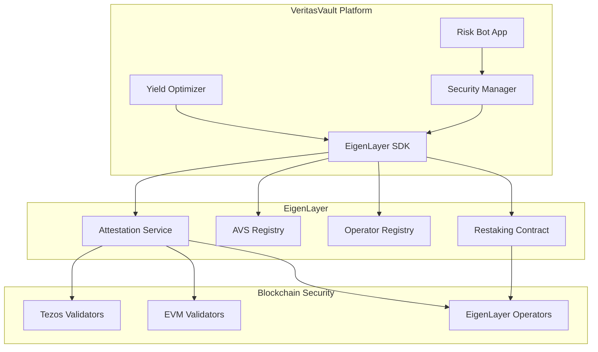

# EigenLayer Integration Guide

## Overview

EigenLayer provides additional security through restaking, enhancing the platform's security model and enabling additional yield opportunities. This guide covers the integration of EigenLayer with the VeritasVault.ai platform, focusing on security attestation, restaking, and AVS (Actively Validated Services) integration.

## Key Features

- **Restaking Protocol**: Enables ETH validators to secure multiple networks
- **AVS Integration**: Connects with Actively Validated Services
- **Enhanced Security Model**: Provides additional security guarantees
- **Yield Optimization**: Creates additional yield opportunities through restaking
- **Multi-Layer Validation**: Combines security across Tezos, EVM, and EigenLayer

## Integration Architecture

## Security Model Integration

### Triple-Layer Security Architecture

VeritasVault.ai implements a triple-layer security model that combines:

1. **Tezos Security Layer**: Leverages Tezos consensus and validation
2. **EVM Security Layer**: Utilizes EVM chain security mechanisms
3. **EigenLayer Security Layer**: Adds restaking security guarantees

This layered approach provides defense-in-depth, requiring an attacker to compromise multiple security mechanisms to affect the platform.

### Security Attestation Flow

For high-value operations, the platform implements a multi-layer attestation process:

1. **Operation Initiation**:
   - User initiates a sensitive operation (e.g., large withdrawal)
   - Risk Bot identifies the need for enhanced security

2. **Attestation Request**:
   - Security Manager requests attestations from multiple layers
   - EigenLayer SDK submits attestation request to EigenLayer

3. **Multi-Layer Validation**:
   - EigenLayer operators validate the operation
   - Tezos validators provide additional verification
   - EVM validators contribute to the security score

4. **Consensus Formation**:
   - Security Manager collects attestations from all layers
   - Weighted consensus determines security approval
   - Operation proceeds only with sufficient security score

## Restaking Integration

### Restaking Benefits

EigenLayer restaking provides several benefits to the VeritasVault.ai platform:

1. **Enhanced Security**: Additional security layer through economic incentives
2. **Yield Opportunities**: Generate additional yield on staked ETH
3. **Slashing Risks**: Disincentivize malicious behavior through slashing
4. **Security Scaling**: Scale security with the size of the ETH staking ecosystem

### Restaking Configuration

The platform integrates with EigenLayer's restaking mechanism through:

1. **Operator Selection**:
   - Define criteria for selecting EigenLayer operators
   - Balance between security, reputation, and cost
   - Implement operator rotation for risk distribution

2. **Stake Allocation**:
   - Determine optimal stake allocation across operators
   - Set minimum and maximum stake per operator
   - Implement dynamic allocation based on performance

3. **Reward Distribution**:
   - Configure reward distribution between platform and users
   - Set fee structure for restaking services
   - Implement transparent reward tracking

## AVS Integration

### AVS Selection Criteria

The platform selects Actively Validated Services based on:

1. **Security Requirements**: Match AVS security to platform needs
2. **Service Compatibility**: Ensure AVS supports required features
3. **Performance Metrics**: Evaluate AVS performance and reliability
4. **Cost Efficiency**: Balance security benefits with cost
5. **Ecosystem Integration**: Prefer AVS with broader ecosystem connections

### AVS Implementation

The platform implements AVS integration through:

1. **Service Registration**:
   - Register with selected AVS providers
   - Configure service parameters
   - Establish communication channels

2. **Validation Request Flow**:
   - Define validation request format
   - Implement request routing logic
   - Configure response handling

3. **Performance Monitoring**:
   - Track AVS response times
   - Monitor validation accuracy
   - Implement fallback mechanisms

## Yield Optimization

### Restaking Yield Strategies

The platform implements several yield strategies with EigenLayer:

1. **Basic Restaking**:
   - Restake ETH with EigenLayer operators
   - Earn base restaking rewards
   - Minimal risk profile

2. **Multi-AVS Participation**:
   - Participate in multiple AVS ecosystems
   - Stack rewards across services
   - Balanced risk-reward profile

3. **Operator Node Running**:
   - Run EigenLayer operator nodes
   - Earn operator rewards
   - Higher technical requirements

### Yield Optimization Algorithm

The platform's yield optimizer considers:

1. **Risk Parameters**:
   - Slashing risk assessment
   - Operator reputation scores
   - Historical performance data

2. **Reward Factors**:
   - Base restaking APR
   - AVS-specific rewards
   - Fee structures

3. **Platform Constraints**:
   - Liquidity requirements
   - Security thresholds
   - Diversification targets

## Implementation Guide

### Integration Components

The EigenLayer integration consists of several key components:

1. **EigenLayer SDK**:
   - Core interface to EigenLayer protocols
   - Handles contract interactions
   - Manages attestation requests

2. **Security Manager**:
   - Coordinates multi-layer security
   - Processes attestation responses
   - Implements security policies

3. **Yield Optimizer**:
   - Manages restaking strategies
   - Optimizes yield generation
   - Balances risk and reward

### Key Interfaces

#### Security Attestation Interface

The security attestation interface handles validation requests and responses:

- **RequestAttestation**: Submits operations for attestation
- **VerifyAttestation**: Verifies attestation responses
- **GetAttestationStatus**: Checks attestation status
- **CancelAttestation**: Cancels pending attestation requests

#### Restaking Management Interface

The restaking management interface handles stake allocation and rewards:

- **AllocateStake**: Distributes stake across operators
- **ClaimRewards**: Claims earned restaking rewards
- **UpdateOperators**: Modifies operator selection
- **GetRestakingMetrics**: Retrieves performance metrics

#### AVS Integration Interface

The AVS integration interface connects with actively validated services:

- **RegisterWithAVS**: Registers with AVS providers
- **SubmitToAVS**: Submits operations for AVS validation
- **GetAVSStatus**: Checks AVS status and health
- **ConfigureAVSParameters**: Updates AVS configuration

## Security Considerations

- **Slashing Risk Management**: Strategies to mitigate slashing risks
- **Operator Diversification**: Avoid concentration with single operators
- **Attestation Thresholds**: Configure appropriate attestation requirements
- **Fallback Mechanisms**: Implement security fallbacks if EigenLayer is unavailable
- **Key Management**: Secure management of signing keys

## Monitoring and Analytics

Key metrics to monitor for the EigenLayer integration:

- **Attestation Success Rate**: Percentage of successful attestations
- **Attestation Time**: Average time to complete attestations
- **Operator Performance**: Performance metrics for selected operators
- **Restaking Yield**: Actual vs. expected yield from restaking
- **Security Score Distribution**: Distribution of security scores across operations

## Troubleshooting

Common issues and solutions:

## Troubleshooting (continued)

| Issue | Possible Cause | Solution |
|-------|---------------|----------|
| Attestation timeout | Operator unavailability | Configure longer timeouts or fallback operators |
| Low attestation count | Insufficient operator selection | Increase operator diversity and count |
| Reward distribution failure | Contract interaction issues | Check gas settings and contract permissions |
| Slashing events | Operator misbehavior | Implement operator blacklisting and stake reallocation |
| AVS integration errors | Incompatible parameters | Verify AVS configuration and update parameters |
| Yield below expectations | Suboptimal allocation | Review and adjust yield optimization algorithm |
| Security score discrepancies | Weight misconfiguration | Recalibrate security layer weights |

## Deployment Strategy

### Phased Rollout

The EigenLayer integration follows a phased deployment approach:

1. **Phase 1: Basic Integration**
   - Integrate with EigenLayer SDK
   - Implement basic attestation flow
   - Set up monitoring and analytics

2. **Phase 2: Restaking Implementation**
   - Deploy restaking contracts
   - Configure operator selection
   - Implement reward distribution

3. **Phase 3: AVS Integration**
   - Select and integrate with AVS providers
   - Implement AVS-specific validation flows
   - Configure AVS parameters

4. **Phase 4: Advanced Features**
   - Implement advanced yield strategies
   - Deploy sophisticated security scoring
   - Enable cross-layer security coordination

### Migration Considerations

When migrating existing systems to include EigenLayer:

1. **Backward Compatibility**:
   - Maintain support for non-EigenLayer security flows
   - Implement feature flags for gradual adoption
   - Support dual-path operations during transition

2. **Data Migration**:
   - Map existing security metrics to EigenLayer model
   - Establish historical performance baselines
   - Preserve audit trails across migration

3. **User Experience**:
   - Communicate security enhancements to users
   - Provide opt-in mechanisms for early adopters
   - Maintain consistent UX during transition

## Governance Integration

### Security Parameter Governance

EigenLayer security parameters are managed through governance:

1. **Governable Parameters**:
   - Required attestation thresholds
   - Operator selection criteria
   - Security score weights
   - Slashing configuration

2. **Governance Process**:
   - Parameter change proposals
   - Expert review by security council
   - Community voting with expertise weighting
   - Timelock for implementation

3. **Emergency Procedures**:
   - Security council override for critical issues
   - Rapid response protocol for vulnerabilities
   - Rollback mechanisms for problematic changes

## Future Roadmap

### Planned Enhancements

1. **Advanced Attestation Mechanisms**:
   - Zero-knowledge attestations for privacy
   - Cross-chain attestation aggregation
   - Reputation-weighted attestation scoring

2. **Enhanced Yield Strategies**:
   - Dynamic operator rotation based on performance
   - Automated yield strategy optimization
   - Custom AVS development for platform-specific needs

3. **Deeper Integration**:
   - Native EigenLayer integration in user interfaces
   - Real-time security scoring visualization
   - Predictive security modeling

## References

- [EigenLayer Protocol Documentation](https://docs.eigenlayer.xyz)
- [Restaking Security Model](https://docs.eigenlayer.xyz/eigenlayer/restaking-guides)
- [AVS Integration Guide](https://docs.eigenlayer.xyz/eigenlayer/avs-guides)
- [Operator Selection Criteria](https://docs.eigenlayer.xyz/eigenlayer/operator-guides)
- [EigenLayer SDK Reference](https://docs.eigenlayer.xyz/eigenlayer/sdk-reference)
