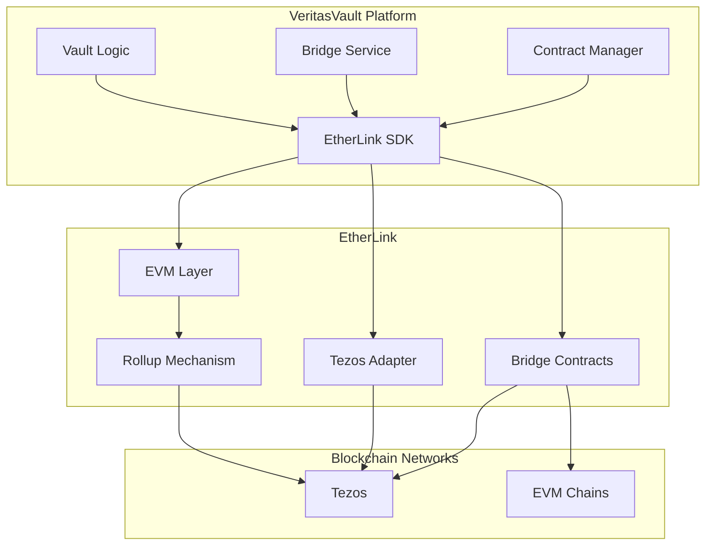

# EtherLink Integration Guide

## Overview

EtherLink provides an EVM compatibility layer for Tezos, enabling VeritasVault.ai to leverage the best of both ecosystems. This guide covers the integration of EtherLink with the platform's architecture, focusing on cross-chain operations, asset bridging, and unified smart contract interactions.

## Key Features

- **EVM Compatibility**: Run Ethereum-compatible smart contracts on Tezos
- **Unified API**: Access both Tezos and EVM functionality through a single interface
- **Asset Bridging**: Seamlessly move assets between Tezos and EVM environments
- **Shared Security Model**: Leverage Tezos consensus with EVM execution
- **Gas Optimization**: Benefit from Tezos' efficient consensus mechanism
- **Contract Portability**: Deploy existing EVM contracts with minimal changes

## Integration Architecture

## Core Components

### EtherLink SDK

The EtherLink SDK provides the primary interface for interacting with the EtherLink environment:

- **Unified RPC Client**: Connect to both Tezos and EVM interfaces
- **Transaction Management**: Handle transactions across both environments
- **Contract Deployment**: Deploy and manage smart contracts
- **Asset Bridge**: Bridge assets between Tezos and EVM
- **Event Monitoring**: Track events across both environments

### Bridge Service

The Bridge Service manages asset transfers between Tezos and EVM environments:

- **Asset Mapping**: Map assets between environments
- **Transfer Verification**: Verify and confirm transfers
- **Fee Management**: Handle bridge fees and gas costs
- **Liquidity Pools**: Manage bridge liquidity
- **Security Checks**: Implement transfer security checks

### Contract Manager

The Contract Manager handles smart contract deployment and interaction:

- **Contract Registry**: Track deployed contracts
- **Deployment Templates**: Standardized deployment patterns
- **Version Management**: Handle contract upgrades
- **ABI Management**: Maintain contract ABIs
- **Cross-Environment Calls**: Coordinate calls between environments

## Integration Patterns

### Unified Contract Deployment

EtherLink enables deployment of contracts that work across both environments:

1. **Contract Development**:
   - Develop using Solidity or other EVM languages
   - Test in standard EVM environments
   - Optimize for EtherLink-specific features

2. **Deployment Process**:
   - Deploy through EtherLink SDK
   - Verify deployment on both layers
   - Register in contract registry

3. **Cross-Layer Interaction**:
   - Call EVM contracts from Tezos
   - Access Tezos features from EVM contracts
   - Maintain consistent state across layers

### Asset Bridging

The platform implements bidirectional asset bridging:

1. **Tezos to EVM**:
   - Lock assets in Tezos contract
   - Generate proof of lock
   - Mint equivalent assets in EVM layer
   - Verify and confirm transaction

2. **EVM to Tezos**:
   - Lock assets in EVM contract
   - Generate proof of lock
   - Release equivalent assets in Tezos
   - Verify and confirm transaction

3. **Security Measures**:
   - Multi-signature verification
   - Timelock for large transfers
   - Fraud proof submission window
   - Rate limiting for suspicious activity

### Cross-Chain Vault Management

The platform leverages EtherLink for unified vault management:

1. **Vault Creation**:
   - Create vault contract on EtherLink
   - Link to Tezos identity
   - Configure cross-chain access controls

2. **Asset Management**:
   - Deposit assets from either environment
   - Track unified balance across chains
   - Optimize asset allocation between environments

3. **Risk Management**:
   - Monitor risk factors across environments
   - Implement cross-chain risk mitigation
   - Provide unified risk scoring

## Implementation Guide

### Configuration

The EtherLink integration requires configuration in several components:

1. **EtherLink SDK Configuration**:
   - RPC endpoints for EtherLink nodes
   - Bridge contract addresses
   - Gas and fee settings
   - Timeout and retry parameters

2. **Bridge Service Configuration**:
   - Asset mappings between environments
   - Transfer limits and thresholds
   - Security parameters
   - Liquidity pool settings

3. **Contract Manager Configuration**:
   - Contract templates
   - Deployment parameters
   - ABI registry settings
   - Version control configuration

### Key Interfaces

#### EtherLink Client Interface

The EtherLink client interface provides access to the EtherLink environment:

- **Connect**: Establish connection to EtherLink nodes
- **SendTransaction**: Submit transactions to EtherLink
- **CallContract**: Call contract methods
- **DeployContract**: Deploy new contracts
- **GetBalance**: Retrieve account balances
- **GetTransaction**: Retrieve transaction details
- **GetReceipt**: Retrieve transaction receipts
- **GetBlock**: Retrieve block information
- **GetEvents**: Retrieve contract events

#### Bridge Interface

The bridge interface manages asset transfers:

- **BridgeToEVM**: Transfer assets from Tezos to EVM
- **BridgeToTezos**: Transfer assets from EVM to Tezos
- **GetBridgeStatus**: Check status of bridge transfers
- **GetBridgeFees**: Calculate bridge fees
- **GetBridgeLiquidity**: Check bridge liquidity
- **CancelTransfer**: Cancel pending transfers

#### Contract Interface

The contract interface manages smart contracts:

- **DeployFromTemplate**: Deploy contract from template
- **UpgradeContract**: Upgrade existing contract
- **RegisterContract**: Register contract in registry
- **GetContractABI**: Retrieve contract ABI
- **CallCrossLayer**: Execute cross-layer contract calls

## Technical Considerations

### Performance Optimization

EtherLink integration requires careful performance optimization:

1. **Gas Optimization**:
   - Optimize contract code for EtherLink's gas model
   - Batch transactions where possible
   - Use efficient data structures

2. **Bridge Efficiency**:
   - Implement batched bridge transfers
   - Optimize proof generation and verification
   - Cache frequently used bridge data

3. **Cross-Layer Calls**:
   - Minimize cross-layer calls for critical paths
   - Cache cross-layer results where appropriate
   - Implement asynchronous processing for non-critical operations

### Security Considerations

The integration implements several security measures:

1. **Bridge Security**:
   - Multi-signature authorization for bridge operations
   - Fraud proof submission period
   - Transfer limits and rate limiting
   - Liquidity protection mechanisms

2. **Contract Security**:
   - Formal verification of critical contracts
   - Comprehensive testing across both environments
   - Upgrade mechanisms with timelock
   - Emergency pause functionality

3. **Cross-Layer Security**:
   - Consistent security model across layers
   - Atomic cross-layer operations
   - Fallback mechanisms for layer failures

## Deployment Strategy

### Phased Rollout

The EtherLink integration follows a phased deployment approach:

1. **Phase 1: Basic Integration**
   - Integrate EtherLink SDK
   - Deploy core bridge contracts
   - Implement basic cross-layer functionality

2. **Phase 2: Asset Bridging**
   - Deploy asset bridge
   - Configure asset mappings
   - Implement bridge security measures

3. **Phase 3: Contract Deployment**
   - Deploy core vault contracts on EtherLink
   - Implement contract registry
   - Configure cross-layer contract calls

4. **Phase 4: Advanced Features**
   - Implement optimized cross-layer operations
   - Deploy advanced bridge features
   - Enable complex cross-chain vault strategies

## Monitoring and Analytics

Key metrics to monitor for the EtherLink integration:

- **Bridge Volume**: Total assets bridged between environments
- **Bridge Latency**: Time to complete bridge operations
- **Cross-Layer Call Performance**: Latency of cross-layer calls
- **Gas Usage**: Gas consumption across environments
- **Contract Deployment Success**: Success rate of contract deployments
- **Error Rates**: Rate of errors by operation type

## Troubleshooting

Common issues and solutions:

| Issue | Possible Cause | Solution |
|-------|---------------|----------|
| Bridge transfer timeout | Network congestion | Increase timeout settings and implement retry logic |
| Contract deployment failure | Gas estimation issues | Manually set gas limits with sufficient buffer |
| Cross-layer call errors | Layer synchronization | Verify state consistency and retry with updated state |
| Bridge liquidity issues | Imbalanced transfers | Rebalance liquidity pools or implement dynamic fees |
| Transaction rejection | Nonce conflicts | Implement proper nonce management |
| State inconsistency | Failed cross-layer operation | Implement reconciliation process |

## References

- [EtherLink Documentation](https://docs.etherlink.com)
- [EVM Compatibility Layer](https://docs.etherlink.com/evm-compatibility)
- [Bridge Protocol](https://docs.etherlink.com/bridge)
- [Contract Deployment Guide](https://docs.etherlink.com/contract-deployment)
- [Cross-Layer Operations](https://docs.etherlink.com/cross-layer)
- [Security Model](https://docs.etherlink.com/security)
