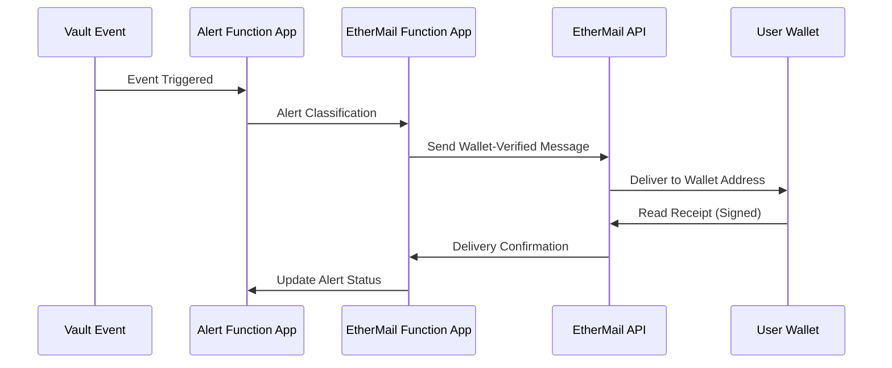

# EtherMail Integration Guide

## Overview

EtherMail provides secure, wallet-verified communications for the VeritasVault.ai platform. This integration enables cryptographically secure messaging tied to user wallets, ensuring that critical notifications, governance communications, and personalized updates reach the intended recipients with verification.

## Key Features

- **Wallet-Verified Communications**: Messages are cryptographically linked to verified wallet addresses
- **Tiered Alert System**: Prioritized delivery based on urgency and impact
- **Governance Communications**: Secure distribution of proposals and voting information
- **Personalized Updates**: User-specific vault performance and risk notifications
- **Read Receipts**: Cryptographic proof that messages were delivered and read
- **End-to-End Encryption**: Secure message content from sender to recipient

## Integration Architecture



## Alert Classification System

| Alert Level | Description | Delivery Method | Example Use Cases |
|------------|-------------|----------------|-------------------|
| Critical | Security breaches, emergency governance actions | Immediate EtherMail + push + on-chain record | Vault security breach, emergency protocol upgrade |
| High | Significant yield changes, security warnings | EtherMail + push notification | Major price movements, collateral warnings |
| Medium | Governance proposals, performance updates | Daily EtherMail digest | New governance proposals, weekly performance |
| Low | Educational content, minor updates | Weekly EtherMail newsletter | New features, educational content |

## Implementation Guide

### 1. Prerequisites

- EtherMail API credentials stored in Azure Key Vault
- User wallet addresses stored in your user database
- Azure Function App configured for EtherMail integration

### 2. EtherMail Client Configuration

```csharp
// EtherMailClient.cs
public class EtherMailClient
{
    private readonly HttpClient _httpClient;
    private readonly string _apiKey;
    
    public EtherMailClient(IConfiguration configuration)
    {
        _httpClient = new HttpClient();
        _httpClient.BaseAddress = new Uri(configuration["EtherMail:BaseUrl"]);
        _apiKey = configuration["EtherMail:ApiKey"];
        _httpClient.DefaultRequestHeaders.Add("X-API-Key", _apiKey);
    }
    
    public async Task<MessageResponse> SendSecureMessage(string walletAddress, string subject, string content, AlertLevel level)
    {
        var message = new SecureMessageRequest
        {
            RecipientWallet = walletAddress,
            Subject = subject,
            Content = content,
            Priority = MapAlertLevelToPriority(level),
            RequireReadReceipt = level >= AlertLevel.High
        };
        
        var response = await _httpClient.PostAsJsonAsync("/api/v1/messages", message);
        response.EnsureSuccessStatusCode();
        
        return await response.Content.ReadFromJsonAsync<MessageResponse>();
    }
    
    private string MapAlertLevelToPriority(AlertLevel level)
    {
        return level switch
        {
            AlertLevel.Critical => "urgent",
            AlertLevel.High => "high",
            AlertLevel.Medium => "normal",
            AlertLevel.Low => "low",
            _ => "normal"
        };
    }
}
```

### 3. Function App Implementation

```csharp
// EtherMailFunction.cs
public static class EtherMailFunction
{
    [FunctionName("ProcessEtherMailAlert")]
    public static async Task Run(
        [EventGridTrigger] EventGridEvent eventGridEvent,
        [Inject] EtherMailClient etherMailClient,
        [Inject] IUserService userService,
        ILogger log)
    {
        log.LogInformation($"Processing EtherMail alert: {eventGridEvent.EventType}");
        
        var alertData = JsonSerializer.Deserialize<AlertData>(eventGridEvent.Data.ToString());
        
        // Get user wallet address
        var userWallet = await userService.GetUserWalletAddress(alertData.UserId);
        
        if (string.IsNullOrEmpty(userWallet))
        {
            log.LogWarning($"No wallet address found for user {alertData.UserId}");
            return;
        }
        
        // Send message via EtherMail
        var response = await etherMailClient.SendSecureMessage(
            userWallet,
            alertData.Subject,
            alertData.Content,
            alertData.Level
        );
        
        log.LogInformation($"EtherMail message sent: {response.MessageId}");
    }
}
```

### 4. Alert Data Model

```csharp
public class AlertData
{
    public string UserId { get; set; }
    public string Subject { get; set; }
    public string Content { get; set; }
    public AlertLevel Level { get; set; }
    public Dictionary<string, string> Metadata { get; set; }
}

public enum AlertLevel
{
    Low = 0,
    Medium = 1,
    High = 2,
    Critical = 3
}
```

## Message Templates

### Critical Security Alert

```
Subject: URGENT: Security Action Required for Your Vault

Dear [User],

A security event has been detected that requires your immediate attention.

Event Type: [Event Type]
Time Detected: [Timestamp]
Risk Level: CRITICAL

Required Action:
[Action Details]

Please verify this transaction by connecting your wallet at [Secure URL].

This message is cryptographically verified by EtherMail and linked to your wallet address.

VeritasVault.ai Security Team
```

### Governance Proposal

```
Subject: New Governance Proposal: [Proposal Title]

Dear [User],

A new governance proposal has been submitted that requires your attention:

Proposal: [Proposal Title]
Submitted by: [Author]
Voting Period: [Start Date] to [End Date]

Summary:
[Proposal Summary]

Your voting power: [Voting Power]

Review and vote on this proposal at [Governance URL].

This message is cryptographically verified by EtherMail and linked to your wallet address.

VeritasVault.ai Governance
```

## Testing and Verification

### Message Delivery Testing

```bash
# Send test message via CLI
az functionapp function invoke --name EtherMailFunctionApp --resource-group VeritasVault --function-name ProcessEtherMailAlert --data '{
  "data": {
    "userId": "test-user-id",
    "subject": "Test Alert",
    "content": "This is a test alert message",
    "level": 2,
    "metadata": {
      "source": "test-script"
    }
  },
  "eventType": "test.alert",
  "dataVersion": "1.0"
}'
```

### Verification Process

1. Send test messages to different alert levels
2. Verify message delivery in EtherMail dashboard
3. Check read receipts for delivered messages
4. Validate message content and formatting
5. Test error handling for invalid wallet addresses

## Troubleshooting

### Common Issues

| Issue | Possible Cause | Solution |
|-------|---------------|----------|
| Message delivery failure | Invalid wallet address | Verify wallet address format and ownership |
| API authentication error | Expired or invalid API key | Rotate API key in Key Vault |
| Rate limiting | Too many messages sent | Implement exponential backoff strategy |
| Content rendering issues | Template formatting errors | Test templates with different content lengths |

### Logging and Monitoring

- Configure Application Insights for the EtherMail Function App
- Set up alerts for message delivery failures
- Monitor message delivery rates and read receipts
- Track user engagement with different alert types

## Security Considerations

- API keys are stored in Azure Key Vault
- All communications with EtherMail API use HTTPS
- Message content is encrypted end-to-end
- Wallet addresses are verified cryptographically
- Read receipts provide non-repudiation for critical alerts

## References

- [EtherMail API Documentation](https://docs.ethermail.io/api)
- [Wallet Verification Protocol](https://docs.ethermail.io/wallet-verification)
- [Message Encryption Standards](https://docs.ethermail.io/encryption)
