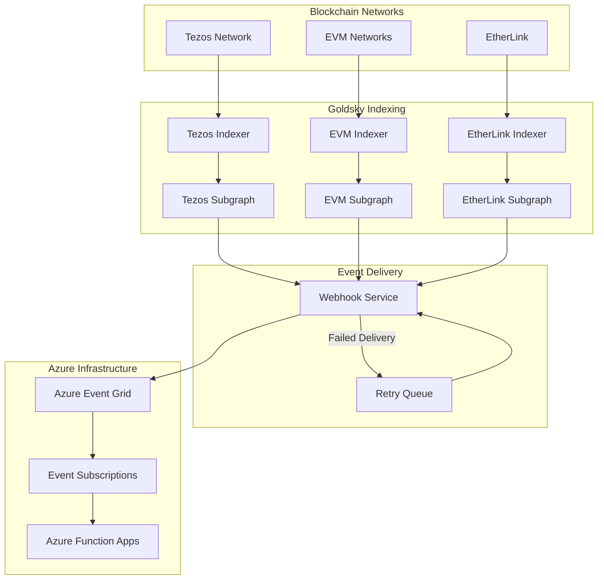

# Goldsky Setup Guide

## Overview

Goldsky provides the primary blockchain data ingestion layer for the VeritasVault.ai platform, enabling real-time event monitoring across multiple chains. This guide covers the setup and configuration of Goldsky subgraphs for Tezos, EVM chains, and EtherLink.

## Key Features

- **Real-time Event Indexing**: Capture and process blockchain events as they occur
- **Multi-chain Support**: Index data from Tezos, EVM chains, and EtherLink
- **Webhook Delivery**: Push events to Azure Event Grid in real-time
- **Custom Filtering**: Reduce noise by filtering events at the source
- **Reliable Delivery**: Retry mechanisms ensure event delivery
- **Schema Flexibility**: Define custom schemas for different contract types

## Architecture Overview



## Subgraph Development

### Subgraph Structure

Each subgraph consists of several key components:

1. **Schema Definition**: Defines the entities and relationships
2. **Manifest**: Configures data sources and event handlers
3. **Mapping Functions**: Transforms blockchain data into entities
4. **Webhook Configuration**: Defines how data is delivered

### Schema Example

```graphql
type Vault @entity {
  id: ID!
  owner: String!
  createdAt: BigInt!
  lastUpdated: BigInt!
  totalValue: BigDecimal!
  assets: [Asset!]! @derivedFrom(field: "vault")
  riskScore: BigDecimal!
  transactions: [VaultTransaction!]! @derivedFrom(field: "vault")
}

type Asset @entity {
  id: ID!
  vault: Vault!
  tokenAddress: String!
  amount: BigDecimal!
  value: BigDecimal!
  lastPriceUpdate: BigInt!
}

type VaultTransaction @entity {
  id: ID!
  vault: Vault!
  transactionType: TransactionType!
  amount: BigDecimal!
  tokenAddress: String!
  timestamp: BigInt!
  blockNumber: BigInt!
  transactionHash: String!
}

enum TransactionType {
  DEPOSIT
  WITHDRAWAL
  LIQUIDATION
  REBALANCE
}
```

## Chain-Specific Setup

### Tezos Subgraph

Tezos subgraphs require special configuration due to the unique structure of Tezos operations:

1. **Contract Origination**: Track contract creation events
2. **Contract Calls**: Monitor specific entrypoints
3. **Internal Operations**: Track internal contract calls
4. **Big Maps**: Index and track big map updates

#### Tezos Manifest Example

```yaml
specVersion: 0.0.1
description: VeritasVault Tezos Indexer
repository: https://github.com/veritasvault/vv-chain-services
schema:
  file: ./schema.graphql
dataSources:
  - kind: tezos
    name: vault-contract
    network: mainnet
    source:
      address: KT1AbCdEf...
      startBlock: 2000000
    mapping:
      kind: tezos/events
      apiVersion: 0.0.1
      language: wasm/assemblyscript
      file: ./mappings/vault.ts
      entities:
        - Vault
        - Asset
        - VaultTransaction
      abis:
        - name: VaultContract
          file: ./abis/vault.json
      eventHandlers:
        - event: deposit
          handler: handleDeposit
        - event: withdrawal
          handler: handleWithdrawal
        - event: liquidation
          handler: handleLiquidation
      bigMapHandlers:
        - bigMap: assets
          handler: handleAssetUpdate
```

### EVM Subgraph

EVM subgraphs follow the standard GraphQL approach:

1. **Contract Events**: Track emitted events
2. **Function Calls**: Monitor specific function calls
3. **State Changes**: Track contract state changes

#### EVM Manifest Example

```yaml
specVersion: 0.0.2
description: VeritasVault EVM Indexer
repository: https://github.com/veritasvault/vv-chain-services
schema:
  file: ./schema.graphql
dataSources:
  - kind: ethereum/contract
    name: vault-contract
    network: mainnet
    source:
      address: "0x1234..."
      abi: VaultContract
      startBlock: 14000000
    mapping:
      kind: ethereum/events
      apiVersion: 0.0.5
      language: wasm/assemblyscript
      file: ./mappings/vault.ts
      entities:
        - Vault
        - Asset
        - VaultTransaction
      abis:
        - name: VaultContract
          file: ./abis/vault.json
      eventHandlers:
        - event: Deposit(address,address,uint256)
          handler: handleDeposit
        - event: Withdrawal(address,address,uint256)
          handler: handleWithdrawal
        - event: Liquidation(address,address,uint256)
          handler: handleLiquidation
```

### EtherLink Subgraph

EtherLink subgraphs combine aspects of both Tezos and EVM approaches:

1. **EVM Compatibility**: Use standard EVM event handling
2. **Tezos Integration**: Track interactions with the Tezos layer
3. **Bridge Events**: Monitor asset transfers between layers

#### EtherLink Manifest Example

```yaml
specVersion: 0.0.2
description: VeritasVault EtherLink Indexer
repository: https://github.com/veritasvault/vv-chain-services
schema:
  file: ./schema.graphql
dataSources:
  - kind: etherlink/contract
    name: vault-contract
    network: mainnet
    source:
      address: "0xEtherLink..."
      abi: VaultContract
      startBlock: 1000000
    mapping:
      kind: etherlink/events
      apiVersion: 0.0.1
      language: wasm/assemblyscript
      file: ./mappings/vault.ts
      entities:
        - Vault
        - Asset
        - VaultTransaction
        - BridgeOperation
      abis:
        - name: VaultContract
          file: ./abis/vault.json
        - name: BridgeContract
          file: ./abis/bridge.json
      eventHandlers:
        - event: Deposit(address,address,uint256)
          handler: handleDeposit
        - event: Withdrawal(address,address,uint256)
          handler: handleWithdrawal
        - event: BridgeTransfer(address,address,uint256,string)
          handler: handleBridgeTransfer
```

## Webhook Configuration

### Setting Up Webhook Delivery

Configure webhooks to deliver events to Azure Event Grid:

1. **Create Webhook Endpoint**: Set up in the Goldsky dashboard
2. **Configure Authentication**: Set up shared access signature
3. **Define Payload Format**: Structure the event data
4. **Set Retry Policy**: Configure retry attempts and backoff

### Webhook Configuration Example

```json
{
  "name": "azure-event-grid-webhook",
  "url": "https://vv-event-grid.eventgrid.azure.net/api/events",
  "headers": {
    "aeg-sas-key": "{{SAS_KEY}}",
    "Content-Type": "application/cloudevents+json"
  },
  "retry": {
    "maxAttempts": 5,
    "initialBackoffMs": 1000,
    "maxBackoffMs": 60000,
    "backoffMultiplier": 2
  },
  "batchSize": 10,
  "eventTypes": ["ENTITY_CREATED", "ENTITY_UPDATED"],
  "entities": ["Vault", "Asset", "VaultTransaction", "BridgeOperation"],
  "format": "CLOUD_EVENTS"
}
```

## Event Filtering

### Reducing Noise

Configure filters to reduce unnecessary event traffic:

1. **Entity Filtering**: Only send events for specific entities
2. **Field Filtering**: Only include relevant fields
3. **Threshold Filtering**: Only send events meeting certain criteria
4. **Rate Limiting**: Prevent event flooding

### Filter Configuration Example

```json
{
  "filters": [
    {
      "entity": "VaultTransaction",
      "conditions": [
        {
          "field": "amount",
          "operator": "GT",
          "value": "1000"
        }
      ]
    },
    {
      "entity": "Asset",
      "conditions": [
        {
          "field": "lastPriceUpdate",
          "operator": "GT",
          "value": "{{NOW_MINUS_1H}}"
        }
      ]
    }
  ]
}
```

## Event Processing

### Event Format

Events delivered to Azure Event Grid follow this structure:

```json
{
  "specversion": "1.0",
  "type": "com.goldsky.entity.updated",
  "source": "https://goldsky.com/subgraphs/tezos-vault",
  "id": "evt-123456",
  "time": "2025-05-01T12:34:56Z",
  "datacontenttype": "application/json",
  "data": {
    "entity": "VaultTransaction",
    "id": "tx-123456",
    "data": {
      "id": "tx-123456",
      "vault": {
        "id": "vault-789"
      },
      "transactionType": "DEPOSIT",
      "amount": "5000.00",
      "tokenAddress": "KT1TokenAddress",
      "timestamp": "1714569296",
      "blockNumber": "2500000",
      "transactionHash": "onxL5J..."
    },
    "previousData": {
      // Only included for updates
    }
  }
}
```

### Event Handling in Azure Functions

Events are processed by Azure Functions:

```csharp
// Example of handling Goldsky events in Azure Functions
[FunctionName("ProcessGoldskyEvent")]
public static async Task Run(
    [EventGridTrigger] EventGridEvent eventGridEvent,
    ILogger log)
{
    log.LogInformation($"Processing Goldsky event: {eventGridEvent.EventType}");
    
    // Parse the event data
    var cloudEvent = JsonSerializer.Deserialize<CloudEvent>(eventGridEvent.Data.ToString());
    var entityData = JsonSerializer.Deserialize<EntityData>(cloudEvent.Data.ToString());
    
    // Process based on entity type
    switch (entityData.Entity)
    {
        case "VaultTransaction":
            await ProcessVaultTransaction(entityData.Data, log);
            break;
        case "Asset":
            await ProcessAssetUpdate(entityData.Data, log);
            break;
        // Handle other entity types
    }
}
```

## Deployment and Operations

### Deployment Process

1. **Develop Locally**: Use Goldsky CLI for local development
2. **Test with Mock Data**: Validate event handling
3. **Deploy to Staging**: Test with real blockchain data
4. **Monitor Event Flow**: Verify event delivery
5. **Deploy to Production**: Roll out to production environment

### Operational Considerations

- **Monitoring**: Set up alerts for webhook failures
- **Scaling**: Monitor event volume and scale as needed
- **Cost Management**: Optimize event filtering to reduce costs
- **Data Retention**: Configure data retention policies
- **Backup and Recovery**: Implement backup procedures

## Troubleshooting

### Common Issues

| Issue | Symptoms | Solution |
|-------|----------|----------|
| Missed events | Data gaps in downstream systems | Check indexer status and reprocess missing blocks |
| Webhook failures | Events not reaching Azure | Verify webhook configuration and authentication |
| Schema mismatches | Parsing errors in Azure Functions | Update schema definitions or mapping functions |
| Indexer lag | Delayed event delivery | Check indexer performance and scaling |
| Rate limiting | HTTP 429 errors | Adjust batch size and implement backoff strategy |

### Diagnostic Tools

- **Goldsky Dashboard**: Monitor indexer status and event delivery
- **Azure Monitor**: Track event processing in Azure Functions
- **Log Analytics**: Analyze event patterns and errors
- **Application Insights**: Monitor performance and failures

## References

- [Goldsky Documentation](https://docs.goldsky.com)
- [Tezos Indexing Guide](https://docs.goldsky.com/tezos)
- [EVM Indexing Guide](https://docs.goldsky.com/evm)
- [EtherLink Integration](https://docs.goldsky.com/etherlink)
- [Webhook Configuration](https://docs.goldsky.com/webhooks)
