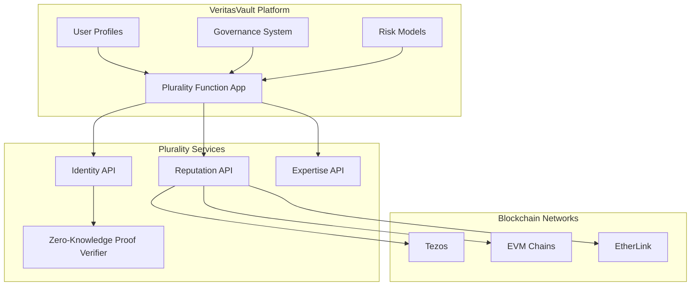

# Plurality Integration Guide

## Overview

Plurality provides identity verification and reputation systems that enhance governance and security for the VeritasVault.ai platform. This guide covers the integration of Plurality's identity and reputation services with the vv-chain-services architecture.

## Key Features

- **Sybil-Resistant Identity Verification**: Ensures one-person-one-vote for governance
- **Multi-Chain Reputation System**: Tracks and rewards valuable contributions across blockchains
- **Expertise-Weighted Voting**: Weights governance votes by domain expertise
- **Black-Litterman Model Integration**: Enhances risk models with expert opinions
- **Privacy-Preserving Verification**: Validates identity without exposing personal data

## Integration Architecture

## Integration Components

### Plurality Function App

The Plurality Function App serves as the bridge between the VeritasVault.ai platform and Plurality services. It handles:

- Identity verification requests
- Reputation score updates and queries
- Expertise domain management
- Governance vote weighting
- Risk model expert input integration

### Identity Verification Flow

1. **User Registration**:
   - User connects wallet(s) to VeritasVault.ai
   - User requests identity verification through the platform
   - Plurality Function App initiates verification process

2. **Verification Process**:
   - User completes verification steps through Plurality
   - Zero-knowledge proofs validate identity without exposing personal data
   - Cross-chain address linking confirms ownership of multiple wallets

3. **Verification Confirmation**:
   - Plurality issues verification credential
   - Credential is stored with user profile
   - Governance and risk systems recognize verified status

### Reputation System

The reputation system tracks user contributions and expertise across multiple domains:

| Expertise Domain | Reputation Factors | Weight in Governance |
|-----------------|-------------------|---------------------|
| Security | Successful security proposals, vulnerability identification, audit participation | High for security-related votes |
| Yield Strategy | Performance of supported strategies, accuracy of yield predictions | High for yield-related votes |
| ML/Data Science | Quality of model improvements, accuracy of scenario generation | High for risk model votes |
| General Governance | Proposal quality, voting alignment with successful outcomes | Baseline for all votes |

### Integration with Risk Models

Plurality's expertise system enhances risk models through:

1. **Expert Opinion Weighting**:
   - Experts in relevant domains provide input on risk parameters
   - Opinions are weighted by domain-specific reputation scores
   - Black-Litterman model incorporates expert views into risk calculations

2. **Scenario Generation**:
   - Domain experts propose stress test scenarios
   - Scenarios are weighted by expert reputation
   - Risk models incorporate high-reputation scenarios

3. **Model Validation**:
   - Experts review and validate risk model outputs
   - Validation weight is determined by reputation scores
   - Feedback loop improves both models and reputation scores

## Implementation Guide

### Configuration

The Plurality integration requires configuration in several components:

1. **Azure Function App Settings**:
   - Plurality API endpoints
   - Authentication credentials
   - Webhook configuration for events

2. **Identity Verification Settings**:
   - Required verification level
   - Cross-chain address linking requirements
   - Governance participation thresholds

3. **Reputation System Settings**:
   - Domain weights
   - Score decay parameters
   - Minimum thresholds for expertise recognition

### Key Interfaces

#### Identity Verification Interface

The identity verification interface handles user verification status and credentials:

- **VerifyIdentity**: Initiates the verification process for a user
- **CheckVerificationStatus**: Checks the current verification status
- **GetVerifiedAddresses**: Retrieves all verified addresses for a user
- **RevokeVerification**: Handles verification revocation if needed

#### Reputation Interface

The reputation interface manages user reputation across domains:

- **GetReputationScore**: Retrieves a user's reputation in specific domains
- **UpdateReputationScore**: Updates reputation based on on-chain activity
- **GetDomainExperts**: Identifies top experts in a specific domain
- **CalculateWeightedVote**: Applies expertise weighting to governance votes

#### Risk Model Integration Interface

The risk model integration interface connects expert opinions to risk models:

- **GetExpertOpinions**: Collects and weights expert opinions on risk parameters
- **ApplyBlackLittermanModel**: Adjusts risk models based on expert views
- **ValidateModelOutput**: Submits model outputs for expert validation
- **IncorporateFeedback**: Updates models based on expert feedback

## Security Considerations

- **Privacy Protection**: All identity verification uses zero-knowledge proofs
- **Sybil Resistance**: Multiple verification methods prevent duplicate identities
- **Reputation Gaming**: Mechanisms to prevent artificial reputation inflation
- **Secure API Access**: All API calls use mutual TLS and API key authentication
- **Data Minimization**: Only necessary data is shared between systems

## Governance Integration

Plurality enhances VeritasVault.ai governance through:

1. **One-Person-One-Vote**: Prevents Sybil attacks in governance
2. **Expertise-Weighted Voting**: Gives more weight to domain experts
3. **Reputation-Based Proposal Thresholds**: Requires minimum reputation to submit proposals
4. **Delegated Voting**: Allows delegation to domain experts
5. **Transparent Reputation**: All reputation scores and calculations are transparent

## Monitoring and Analytics

Key metrics to monitor for the Plurality integration:

- **Verification Success Rate**: Percentage of completed verifications
- **Verification Time**: Average time to complete verification
- **Reputation Distribution**: Distribution of reputation scores by domain
- **Governance Participation**: Percentage of verified users participating in governance
- **Expert Opinion Impact**: Measure of how expert opinions affect risk models

## Troubleshooting

Common issues and solutions:

| Issue | Possible Cause | Solution |
|-------|---------------|----------|
| Verification failure | Incomplete user information | Guide user through required verification steps |
| Address linking failure | Signature mismatch | Provide clear signing instructions for each chain |
| Reputation not updating | Event processing delay | Check event processing queue and logs |
| Expertise weighting issues | Domain configuration | Verify domain weights and calculation parameters |
| Governance vote weighting errors | Reputation data access | Check API connectivity and authentication |

## References

- [Plurality API Documentation](https://docs.plurality.network/api)
- [Black-Litterman Model Overview](https://docs.plurality.network/risk-models)
- [Zero-Knowledge Identity Verification](https://docs.plurality.network/zk-identity)
- [Reputation System Design](https://docs.plurality.network/reputation)
