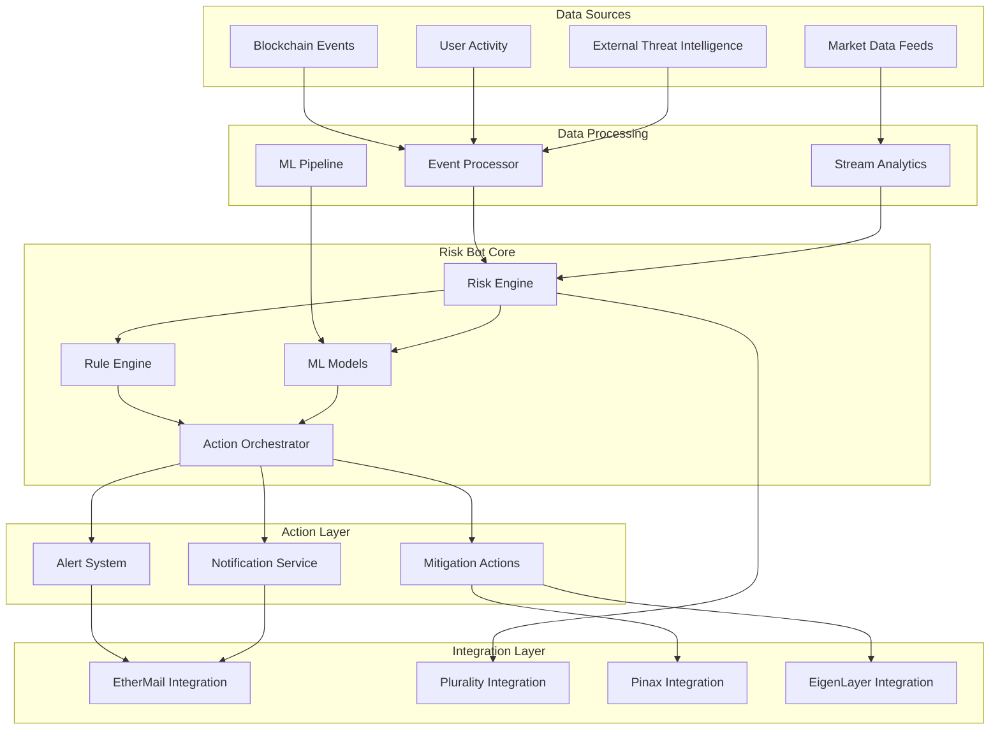

# Risk Bot System Documentation

## Overview

The Risk Bot system provides automated risk assessment and mitigation for the VeritasVault.ai platform. It continuously monitors on-chain and off-chain data sources to identify potential risks, trigger alerts, and initiate protective actions when necessary.

## Key Features

- **Real-time Risk Monitoring**: Continuous assessment of vault risk factors
- **Multi-chain Data Analysis**: Aggregates risk signals across Tezos, EVM chains, and EtherLink
- **Machine Learning Integration**: Uses ML models to predict risk trends
- **Automated Mitigation**: Takes predefined actions to protect user assets
- **Alert Generation**: Sends tiered alerts through multiple channels
- **Risk Visualization**: Provides clear risk dashboards for users and administrators
- **Audit Trail**: Maintains comprehensive logs of risk events and actions

## System Architecture



## Core Components

### Risk Engine

The Risk Engine is the central component that processes and analyzes risk factors:

- **Risk Factor Aggregation**: Combines multiple risk signals
- **Risk Score Calculation**: Computes normalized risk scores
- **Threshold Monitoring**: Tracks when risks exceed defined thresholds
- **Trend Analysis**: Identifies developing risk patterns
- **Correlation Detection**: Finds relationships between risk factors

### Rule Engine

The Rule Engine applies predefined rules to risk data:

- **Rule Definition**: Declarative rule specification
- **Rule Evaluation**: Applies rules to current risk state
- **Action Triggering**: Initiates actions based on rule matches
- **Rule Prioritization**: Handles conflicts between rules
- **Rule Versioning**: Manages rule lifecycle

### ML Models

The system uses several machine learning models:

- **Price Volatility Prediction**: Forecasts asset price movements
- **Liquidation Risk Assessment**: Predicts potential liquidation events
- **Anomaly Detection**: Identifies unusual patterns in user or market behavior
- **Risk Clustering**: Groups similar risk profiles
- **Sentiment Analysis**: Analyzes market sentiment from external sources

### Action Orchestrator

The Action Orchestrator coordinates response actions:

- **Action Selection**: Chooses appropriate actions based on risk assessment
- **Action Prioritization**: Determines action execution order
- **Action Execution**: Triggers actions through appropriate channels
- **Action Monitoring**: Tracks action completion and effectiveness
- **Feedback Loop**: Updates risk assessment based on action outcomes

## Risk Assessment Model

### Risk Factors

The system monitors multiple risk categories:

| Risk Category | Risk Factors | Data Sources | Weight |
|--------------|-------------|-------------|--------|
| Market Risk | Price volatility, liquidity, correlation | Market data feeds, DEX activity | 30% |
| Credit Risk | Collateralization ratio, debt exposure | On-chain positions, lending protocols | 25% |
| Operational Risk | Smart contract vulnerabilities, governance attacks | Security scanners, governance proposals | 20% |
| Liquidity Risk | Withdrawal patterns, liquidity pool depth | On-chain activity, DEX metrics | 15% |
| Counterparty Risk | Protocol solvency, bridge security | Protocol metrics, security audits | 10% |

### Risk Score Calculation

Risk scores are calculated using a multi-factor model:

1. **Individual Factor Scoring**:
   - Each factor is normalized to a 0-100 scale
   - Factors are adjusted for recent volatility
   - Outliers are handled with statistical methods

2. **Weighted Aggregation**:
   - Factors are weighted by importance
   - Category scores are calculated
   - Overall risk score is computed

3. **Dynamic Adjustment**:
   - Weights adapt based on market conditions
   - Historical correlation influences weights
   - Expert input from Plurality adjusts weights

### Risk Thresholds

The system defines multiple risk thresholds:

| Risk Level | Score Range | Alert Level | Action Level |
|-----------|------------|------------|-------------|
| Low | 0-25 | Informational | None |
| Moderate | 26-50 | Low | Monitoring |
| Elevated | 51-75 | Medium | Preventive |
| High | 76-90 | High | Protective |
| Critical | 91-100 | Critical | Emergency |

## Automated Actions

### Alert Generation

The system generates tiered alerts:

| Alert Level | Delivery Method | Frequency | Content |
|------------|----------------|-----------|---------|
| Informational | Weekly digest | Weekly | Risk summary, educational content |
| Low | Daily digest | Daily | Risk factors, recommended actions |
| Medium | Direct notification | Real-time | Specific risks, action recommendations |
| High | Priority notification | Real-time | Urgent risks, required actions |
| Critical | Multi-channel alert | Real-time | Emergency information, automatic actions |

### Mitigation Actions

The system can initiate various mitigation actions:

1. **Monitoring Actions**:
   - Increase monitoring frequency
   - Enable additional data sources
   - Trigger manual review

2. **Preventive Actions**:
   - Suggest portfolio rebalancing
   - Recommend additional collateral
   - Propose position reduction

3. **Protective Actions**:
   - Temporarily pause withdrawals
   - Add collateral from reserves
   - Hedge positions automatically

4. **Emergency Actions**:
   - Initiate emergency shutdown
   - Execute safe mode procedures
   - Activate security council

## Implementation Details

### Event Processing Pipeline

The event processing pipeline handles data ingestion and processing:

1. **Event Ingestion**:
   - Blockchain events from Goldsky
   - Market data from external APIs
   - User activity from application logs
   - Threat intelligence from security feeds

2. **Event Normalization**:
   - Convert to standard format
   - Enrich with additional context
   - Filter irrelevant events
   - Deduplicate redundant events

3. **Event Correlation**:
   - Group related events
   - Establish causal relationships
   - Identify event patterns
   - Calculate derived metrics

4. **Event Storage**:
   - Short-term in-memory processing
   - Medium-term in Cosmos DB
   - Long-term in Data Lake
   - Analytical storage in Synapse

### Machine Learning Pipeline

The ML pipeline handles model training and inference:

1. **Data Preparation**:
   - Feature extraction
   - Feature normalization
   - Missing data handling
   - Outlier detection

2. **Model Training**:
   - Supervised learning for predictive models
   - Unsupervised learning for anomaly detection
   - Reinforcement learning for action selection
   - Ensemble methods for robust predictions

3. **Model Deployment**:
   - Model versioning
   - A/B testing
   - Shadow deployment
   - Gradual rollout

4. **Model Monitoring**:
   - Performance metrics
   - Drift detection
   - Retraining triggers
   - Feedback collection

### Rule Engine Implementation

The rule engine uses a declarative rule format:

```json
{
  "ruleId": "high-volatility-alert",
  "description": "Alert on high market volatility",
  "conditions": [
    {
      "factor": "price_volatility",
      "operator": "gt",
      "value": 30,
      "timeWindow": "1h"
    },
    {
      "factor": "trading_volume",
      "operator": "gt",
      "value": "200%",
      "comparedTo": "24h_average"
    }
  ],
  "actions": [
    {
      "type": "alert",
      "level": "medium",
      "template": "volatility-alert",
      "channels": ["ethermail", "app-notification"]
    },
    {
      "type": "monitoring",
      "action": "increase_frequency",
      "parameters": {
        "interval": "5m",
        "duration": "24h"
      }
    }
  ],
  "priority": 3,
  "enabled": true
}
```

## Integration Points

### EtherMail Integration

The Risk Bot integrates with EtherMail for secure notifications:

- **Alert Delivery**: Sends wallet-verified alerts
- **Tiered Notifications**: Maps risk levels to notification priority
- **Action Confirmations**: Receives confirmation of user actions
- **Read Receipts**: Tracks alert delivery and reading

### Plurality Integration

The Risk Bot leverages Plurality for expert input:

- **Expert Opinion Collection**: Gathers domain expert insights
- **Reputation-Weighted Input**: Weights opinions by expertise
- **Black-Litterman Model**: Incorporates expert views into risk models
- **Feedback Loop**: Improves expert reputation based on accuracy

### Pinax Integration

The Risk Bot uses Pinax for cross-chain actions:

- **Multi-Chain Monitoring**: Tracks risk across chains
- **Cross-Chain Actions**: Executes protective actions across chains
- **Transaction Bundling**: Groups related transactions
- **Security Attestation**: Verifies high-risk actions

### EigenLayer Integration

The Risk Bot leverages EigenLayer for additional security:

- **Security Attestation**: Requests attestations for high-risk actions
- **Multi-Layer Validation**: Combines security across layers
- **Slashing Risk Management**: Monitors and manages slashing risks
- **Operator Selection**: Chooses reliable operators for attestations

## Operational Procedures

### Monitoring and Maintenance

1. **System Health Monitoring**:
   - Component health checks
   - Performance metrics
   - Resource utilization
   - Error rates

2. **Model Maintenance**:
   - Regular retraining schedule
   - Performance evaluation
   - Feature importance analysis
   - Model versioning

3. **Rule Management**:
   - Rule effectiveness review
   - Rule update process
   - A/B testing for new rules
   - Rule deprecation process

### Incident Response

1. **Alert Investigation**:
   - Initial assessment
   - Data collection
   - Root cause analysis
   - Impact evaluation

2. **Mitigation Process**:
   - Immediate actions
   - Communication plan
   - Stakeholder notification
   - Recovery steps

3. **Post-Incident Review**:
   - Incident documentation
   - Lessons learned
   - Process improvements
   - System enhancements

## Risk Bot Dashboard

### User Dashboard

The user dashboard provides risk visibility:

1. **Risk Overview**:
   - Current risk score
   - Risk trend over time
   - Risk breakdown by category
   - Comparison to similar users

2. **Alert History**:
   - Recent alerts
   - Alert details
   - Action history
   - Resolution status

3. **Action Recommendations**:
   - Suggested actions
   - Expected impact
   - Implementation steps
   - Action history

### Admin Dashboard

The admin dashboard provides system oversight:

1. **System Overview**:
   - Overall risk distribution
   - Alert volume and trends
   - Action effectiveness
   - System performance

2. **User Risk Analysis**:
   - High-risk users
   - Risk clustering
   - Emerging patterns
   - Intervention opportunities

3. **Model Performance**:
   - Prediction accuracy
   - Model drift
   - Feature importance
   - Retraining status

## Security and Compliance

### Data Protection

1. **Data Encryption**:
   - Encryption at rest
   - Encryption in transit
   - Key management
   - Access controls

2. **Data Minimization**:
   - Purpose limitation
   - Storage limitation
   - Data anonymization
   - Aggregation techniques

3. **Access Controls**:
   - Role-based access
   - Just-in-time access
   - Privileged access management
   - Access auditing

### Audit and Compliance

1. **Audit Trail**:
   - Risk assessment history
   - Action logs
   - User notifications
   - System changes

2. **Compliance Reporting**:
   - Regulatory requirements
   - Internal policies
   - External audits
   - Transparency reports

## Future Enhancements

### Planned Improvements

1. **Advanced Analytics**:
   - Graph-based risk analysis
   - Network effect modeling
   - Systemic risk assessment
   - Contagion risk modeling

2. **Enhanced ML Capabilities**:
   - Deep learning models
   - Natural language processing
   - Reinforcement learning
   - Explainable AI

3. **User Experience**:
   - Personalized risk insights
   - Interactive risk simulations
   - Scenario planning tools
   - Guided risk mitigation

### Research Areas

1. **Risk Prediction**:
   - Long-term risk forecasting
   - Black swan event prediction
   - Stress test scenario generation
   - Multi-factor risk modeling

2. **Automated Mitigation**:
   - Self-healing systems
   - Autonomous risk management
   - Adaptive protection strategies
   - Predictive intervention

3. **Cross-Chain Risk**:
   - Bridge vulnerability assessment
   - Cross-chain contagion modeling
   - Protocol interdependency mapping
   - Unified risk scoring

## References

- [Risk Management Framework](https://docs.veritasvault.ai/risk-framework)
- [Machine Learning Model Documentation](https://docs.veritasvault.ai/ml-models)
- [Rule Engine Specification](https://docs.veritasvault.ai/rule-engine)
- [Alert System Documentation](https://docs.veritasvault.ai/alert-system)
- [Integration APIs](https://docs.veritasvault.ai/integration-apis)
- [Operational Procedures](https://docs.veritasvault.ai/operations)
