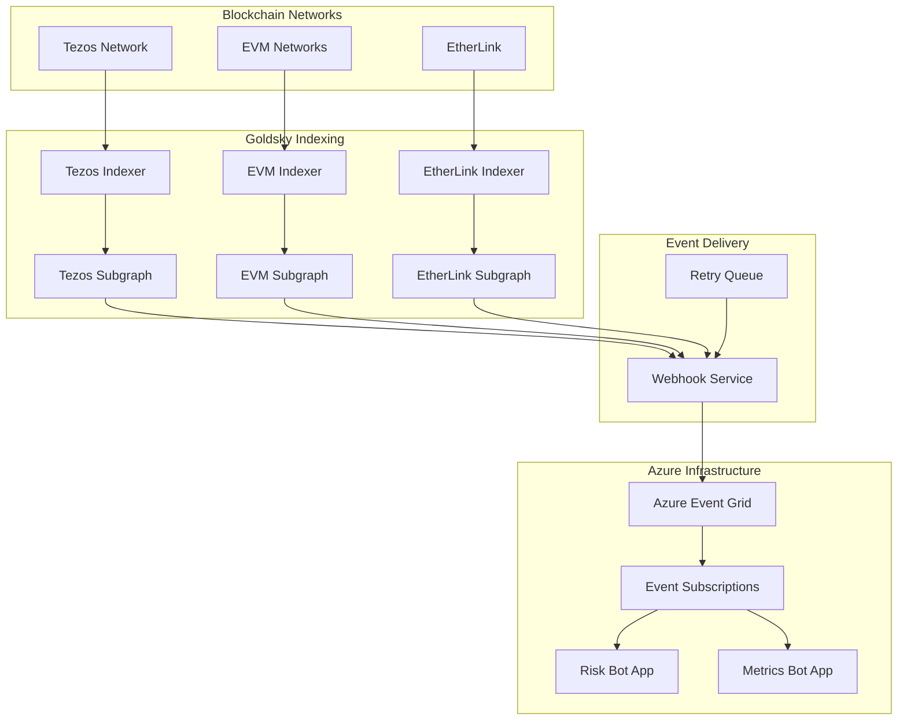

# Goldsky Subgraphs for VeritasVault

Goldsky provides the primary blockchain data ingestion layer for the VeritasVault.ai platform, enabling real-time event monitoring across multiple chains. This guide covers the setup, deployment, and monitoring of Goldsky subgraphs for Tezos, EVM chains, and EtherLink.

## Table of Contents

- [Overview](#overview)
- [Prerequisites](#prerequisites)
- [Getting Started with Goldsky](#getting-started-with-goldsky)
- [Contract Addresses](#contract-addresses)
- [Directory Structure](#directory-structure)
- [Subgraph Configuration](#subgraph-configuration)
- [Deployment Instructions](#deployment-instructions)
- [Webhook Configuration](#webhook-configuration)
- [Monitoring and Troubleshooting](#monitoring-and-troubleshooting)
- [Development Workflow](#development-workflow)
- [CI/CD Integration](#cicd-integration)

## Overview

The VeritasVault platform uses Goldsky subgraphs to index and transform blockchain events from:

- **Tezos**: For FA2 tokens and vaults
- **EVM Networks**: For ERC-20 tokens and vaults
- **EtherLink**: For cross-chain operations

These subgraphs send events via webhooks to Azure Event Grid, which then routes them to appropriate Azure Functions for processing.



## Prerequisites

Before deploying the subgraphs, ensure you have:

1. **Node.js and npm**: Version 16.x or higher
2. **Goldsky Account**: Create an account at [goldsky.com](https://goldsky.com)
3. **Contract Addresses**: For Tezos, EVM, and EtherLink networks
4. **Azure Event Grid**: Endpoint URL and API key
5. **Contract ABIs**: JSON files defining your contract interfaces

## Getting Started with Goldsky

### Creating a Goldsky Account

1. Visit [goldsky.com](https://goldsky.com) and sign up for an account
2. After registration, generate an API key from your account settings
3. Store this API key securely as you'll need it for authentication

### Creating Subgraphs in Goldsky Dashboard

Before deploying your subgraphs via CLI, you need to create them in the Goldsky dashboard:

1. Log in to your Goldsky dashboard
2. Navigate to "Subgraphs" section
3. Click "Create New Subgraph"
4. For each network (Tezos, EVM, EtherLink), create a separate subgraph:
   - Name: `veritasvault/tezos-mainnet`, `veritasvault/evm-mainnet`, `veritasvault/etherlink-mainnet`
   - Network: Select the corresponding network (Tezos, Ethereum, EtherLink)
   - Description: Add a brief description of what the subgraph indexes

### Installing Goldsky CLI

The Goldsky CLI is already installed locally in this project. To authenticate:

```bash
cd src/goldsky
npm run login
```

When prompted, enter your Goldsky API key.

## Contract Addresses

### Obtaining Contract Addresses

You need the deployed contract addresses for each network to configure your subgraphs:

#### For EVM and EtherLink Contracts:

1. **From Deployment Records**: If you deployed the contracts, check your deployment logs or transaction history
2. **From Block Explorers**:
   - For Ethereum: Use [Etherscan](https://etherscan.io)
   - For EtherLink: Use the EtherLink block explorer
3. **From Infrastructure Team**: If contracts were deployed by another team, request the addresses

#### For Tezos Contracts:

1. **From Deployment Records**: Check your origination operation hash
2. **From Block Explorers**: Use [TzStats](https://tzstats.com) or [Better Call Dev](https://better-call.dev)

### Updating Subgraph Configurations

Once you have the contract addresses, update them in the corresponding subgraph.yaml files:

1. **For Tezos**: In `tezos/subgraph.yaml`, replace:

   ```yaml
   source:
     address: KT1... # Replace with your actual Tezos contract address
   ```

2. **For EVM**: In `evm/subgraph.yaml`, replace:

   ```yaml
   source:
     address: "0x..." # Replace with your actual EVM contract address
   ```

3. **For EtherLink**: In `etherlink/subgraph.yaml`, replace:

   ```yaml
   source:
     address: "0x..." # Replace with your actual EtherLink contract address
   ```

### Start Block Optimization

For better indexing performance, set the `startBlock` parameter to the block where your contract was deployed:

```yaml
source:
  address: "0x..."
  abi: VaultContract
  startBlock: 12345678 # Replace with actual deployment block
```

## Directory Structure

```
src/goldsky/
├── package.json            # NPM scripts for deployment and monitoring
├── subgraph.config.yml     # Global configuration for all subgraphs
├── tezos/                  # Tezos-specific subgraph
│   ├── schema.graphql      # GraphQL schema for Tezos entities
│   ├── tezos-mapping.ts    # Event handlers for Tezos events
│   ├── subgraph.yaml       # Subgraph manifest for Tezos
│   └── abis/               # Contract ABIs for Tezos
├── evm/                    # EVM-specific subgraph
│   ├── schema.graphql      # GraphQL schema for EVM entities
│   ├── evm-mapping.ts      # Event handlers for EVM events
│   ├── subgraph.yaml       # Subgraph manifest for EVM
│   └── abis/               # Contract ABIs for EVM
└── etherlink/              # EtherLink-specific subgraph
    ├── schema.graphql      # GraphQL schema for EtherLink entities
    ├── etherlink-mapping.ts # Event handlers for EtherLink events
    ├── subgraph.yaml       # Subgraph manifest for EtherLink
    └── abis/               # Contract ABIs for EtherLink
```

## Subgraph Configuration

Each subgraph consists of:

1. **Schema Definition**: Defines entities like Vault, Transaction, and PriceUpdate
2. **Mapping Files**: Handlers for blockchain events
3. **Manifest File**: Configuration for data sources and event handlers
4. **ABI Files**: Contract interfaces for event parsing

### Updating ABIs

The ABI files in this repository are templates. You should replace them with the actual ABIs of your deployed contracts:

1. **For EVM and EtherLink**:

   - Export the ABI from your contract compilation artifacts
   - Or get the verified contract ABI from Etherscan
   - Replace the contents of `evm/abis/VaultContract.json` and `etherlink/abis/VaultContract.json`

2. **For Tezos**:
   - Get the contract interface from Better Call Dev or your deployment artifacts
   - Update `tezos/abis/VaultContract.json` with the correct Michelson interface

## Deployment Instructions

### Initial Setup

1. **Install Dependencies**:

   ```bash
   cd src/goldsky
   npm install
   ```

2. **Login to Goldsky**:

   ```bash
   npm run login
   ```

3. **Update Contract Addresses**:
   Before deploying, update the contract addresses in each `subgraph.yaml` file:

   - In `tezos/subgraph.yaml`: Replace `KT1...` with your Tezos contract address
   - In `evm/subgraph.yaml`: Replace `"0x..."` with your EVM contract address
   - In `etherlink/subgraph.yaml`: Replace `"0x..."` with your EtherLink contract address

4. **Set Environment Variables**:

   ```bash
   # On Windows
   set WEBHOOK_API_KEY=your-api-key-here

   # On Linux/Mac
   export WEBHOOK_API_KEY=your-api-key-here
   ```

### Deployment Commands

Deploy each subgraph using the provided npm scripts:

#### EtherLink Subgraph

```bash
npm run deploy:etherlink
```

#### Tezos Subgraph

```bash
npm run deploy:tezos
```

#### EVM Subgraph

```bash
npm run deploy:evm
```

## Webhook Configuration

After deploying each subgraph, set up webhooks to send events to Azure Event Grid:

### EtherLink Webhook

```bash
npm run webhook:etherlink
```

#### Tezos Webhook

```bash
npm run webhook:tezos
```

#### EVM Webhook

```bash
npm run webhook:evm
```

## Monitoring and Troubleshooting

### Checking Subgraph Status

Monitor the status of your subgraphs:

```bash
# Check EtherLink subgraph status
npm run status:etherlink

# Check Tezos subgraph status
npm run status:tezos

# Check EVM subgraph status
npm run status:evm
```

### Viewing Logs

View logs to troubleshoot issues:

```bash
# View EtherLink subgraph logs
npm run logs:etherlink

# View Tezos subgraph logs
npm run logs:tezos

# View EVM subgraph logs
npm run logs:evm
```

### Common Issues and Solutions

1. **Indexing Not Starting**:

   - Verify contract address is correct
   - Check if the start block is valid
   - Ensure ABI matches the deployed contract

2. **Missing Events**:

   - Verify event signatures in the ABI
   - Check if handlers are correctly implemented
   - Ensure the contract emits the expected events

3. **Webhook Failures**:
   - Check Azure Event Grid endpoint availability
   - Verify API key is correct
   - Check network connectivity

## Development Workflow

### Local Testing

Test your subgraphs locally before deployment:

1. **Start Local Development Environment**:

   ```bash
   npx @goldskycom/cli dev
   ```

2. **Test GraphQL Queries**:
   Open the GraphQL playground at `http://localhost:8000/graphql`

### Schema Updates

When updating your schema:

1. Edit the `schema.graphql` file
2. Update corresponding mapping handlers
3. Redeploy the subgraph

### Adding New Events

To track new contract events:

1. Update the ABI file with new event signatures
2. Add new event handlers in the mapping file
3. Register the event handlers in the subgraph manifest
4. Redeploy the subgraph

## CI/CD Integration

Integrate subgraph deployment into your CI/CD pipeline:

```yaml
# Example GitHub Actions workflow
name: Deploy Goldsky Subgraphs

on:
  push:
    branches: [main]
    paths:
      - "src/goldsky/**"

jobs:
  deploy:
    runs-on: ubuntu-latest
    steps:
      - uses: actions/checkout@v3
      - uses: actions/setup-node@v3
        with:
          node-version: "16"
      - name: Install dependencies
        run: cd src/goldsky && npm install
      - name: Login to Goldsky
        run: cd src/goldsky && npx @goldskycom/cli login
        env:
          GOLDSKY_API_KEY: ${{ secrets.GOLDSKY_API_KEY }}
      - name: Deploy EtherLink subgraph
        run: cd src/goldsky && npm run deploy:etherlink
      - name: Deploy Tezos subgraph
        run: cd src/goldsky && npm run deploy:tezos
      - name: Deploy EVM subgraph
        run: cd src/goldsky && npm run deploy:evm
      - name: Configure webhooks
        run: |
          cd src/goldsky
          npm run webhook:etherlink
          npm run webhook:tezos
          npm run webhook:evm
        env:
          WEBHOOK_API_KEY: ${{ secrets.WEBHOOK_API_KEY }}
```

## Event Data Format

Events sent to Azure Event Grid follow this format:

```json
{
  "specversion": "1.0",
  "type": "com.goldsky.entity.updated",
  "source": "https://goldsky.com/subgraphs/veritasvault/etherlink-mainnet",
  "id": "evt-123456",
  "time": "2025-05-11T12:34:56Z",
  "datacontenttype": "application/json",
  "data": {
    "entity": "Vault",
    "id": "0x1234567890abcdef",
    "block": {
      "hash": "0xabcdef1234567890",
      "number": 12345678
    },
    "transaction": {
      "hash": "0x0987654321fedcba"
    },
    "data": {
      "owner": "0x1234567890abcdef",
      "totalValue": "1000000000000000000",
      "createdAt": "1620000000",
      "updatedAt": "1620001000"
    }
  }
}
```

---

For additional support or questions, contact the VeritasVault blockchain team or refer to the [Goldsky documentation](https://docs.goldsky.com/).
